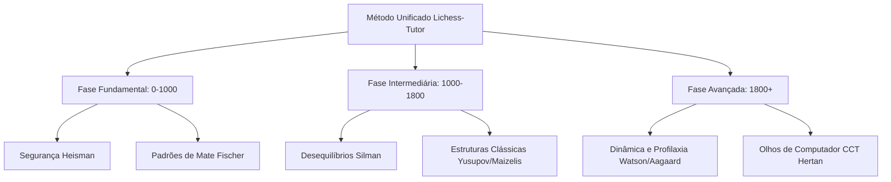

# Analise do Acervo - GEMINI

---

## Passo 1 - Varredura e Fichamento do Acervo
*Autoria: Gemini*

Abaixo constam as fichas pedagógicas detalhadas dos 20 livros de maior impacto estrutural encontrados no acervo, seguidas por Fichas Coletivas que organizam, avaliam e triam as outras mais de 100 obras redundantes, especializadas ou de menor valor pedagógico direto para o `lichess-tutor`.

---

### Fichas Individuais (Principais Obras)

#### 1. The Soviet Chess Primer (Ilya Maizelis)
*   **Identificação**: *The Soviet Chess Primer*, Ilya Maizelis. Faixa de força: 800-1600. Promessa: "Instilar uma compreensão profunda dos elementos científicos e geométricos que formam o xadrez, ensinando o aluno a pensar com rigor."
*   **Filosofia de ensino**: Acredita que o xadrez se aprende dominando as propriedades geométricas puras das peças e do tabuleiro, começando pelo rei e peões (finais), passando pelo cálculo estruturado de variantes e pela coordenação harmônica.
*   **Sequência**: Começa pelas regras e movimentação elementar, mas foca imediatamente na geometria das forças (peões e reis), passando para finais simples, mate coordenado, e só então introduz tática complexa e estratégia.
*   **Como explica**: Didática clássica rigorosa, sem floreios. Explica o tabuleiro como uma matriz de forças e coordenadas. Usa definições formais que forçam o estudante a entender a matemática por trás da oposição e das casas conjugadas.
*   **Como exercita**: Problemas estruturados de fim de capítulo com alto grau de precisão geométrica. O aluno deve deduzir a linha exata; chutes são punidos.
*   **Como dá feedback**: Focado na precisão do cálculo e na identificação de "lances geometricamente incorretos".
*   **O melhor para absorver**: 1. O foco em finais de peões elementares antes da tática de meio-jogo para treinar visualização pura. 2. O conceito de "geometria das peças" (linhas abertas, diagonais, cravadas geométricas).
*   **O que descartar**: A notação descritiva histórica de edições antigas (quando houver) e o tom excessivamente rígido de algumas análises que ignoram o dinamismo moderno.
*   **Encaixe**: `band`: 800-1200 | `stage`: final | `exerciseMode`: explain / retrieval.
*   **Mapeável no Lichess?**: Sim. Lichess Practice (Pawn Endgames) e Lichess Studies para coordenadas.
*   **Status legal provável**: Copyright ativo da edição traduzida moderna, mas a base histórica russa está próxima do domínio público.

#### 2. Bobby Fischer Teaches Chess (Bobby Fischer, Margulies, Mosenfelder)
*   **Identificação**: *Bobby Fischer Teaches Chess*, Bobby Fischer et al. Faixa de força: 0-800. Promessa: "Aprender a ver mates em um e dois lances com velocidade e sem esforço através de instrução programada."
*   **Filosofia de ensino**: Acredita na fixação mecânica de padrões. O xadrez não é especulação, é reconhecimento de alvos geométricos (principalmente a última fileira e redes de mate clássicas).
*   **Sequência**: Puramente linear. Parte do mate mais simples (última fileira sem defesa) até redes de mate complexas com sacrifícios de atração.
*   **Como explica**: Instrução programada pura (Frames). Cada página apresenta um único diagrama simplificado e uma pergunta binária ou direta ("Pode o mate ser evitado?", "Onde está o xeque-mate?").
*   **Como exercita**: O estudante é exposto a variações mínimas do mesmo padrão. A resposta correta está no verso, forçando a confirmação instantânea.
*   **Como dá feedback**: Feedback imediato e binário. Se errou, volta-se ao frame anterior para rever a regra geométrica.
*   **O melhor para absorver**: O método de "frames de variação incremental" (worked example com mudança mínima) para consolidar redes de mate de forma subconsciente.
*   **O que descartar**: A ausência total de discussões sobre defesa, abertura e segurança de peças fora do contexto de xeque-mate.
*   **Encaixe**: `band`: 0-600, 600-1000 | `stage`: mate | `exerciseMode`: guided / retrieval.
*   **Mapeável no Lichess?**: Sim, através de Lichess Puzzles filtrados por `mateIn1` e `mateIn2` com tempo curto.
*   **Status legal provável**: Sob copyright. Não copiar os diagramas; recriar a estrutura incremental.

#### 3. Logical Chess: Move by Move (Irving Chernev)
*   **Identificação**: *Logical Chess: Move by Move*, Irving Chernev. Faixa de força: 600-1200. Promessa: "Mostrar que cada lance jogado por um mestre tem uma explicação lógica que pode ser compreendida por qualquer amador."
*   **Filosofia de ensino**: O xadrez é um jogo de causa e efeito. Não existem lances neutros. Cada peão movido cria uma fraqueza e abre uma linha.
*   **Sequência**: 33 partidas completas comentadas do primeiro ao último lance, divididas em ataque ao rei rochado, jogos posicionais e a importância do centro.
*   **Como explica**: Estilo extremamente conversacional. Explica os lances iniciais repetidamente em todas as partidas (ex: por que 1.e4 controla d5 e f5 e abre caminhos para a dama e bispo) para fixar os princípios por repetição espaçada no texto.
*   **Como exercita**: O leitor acompanha passivamente a partida, mas é desafiado mentalmente pela constante pergunta: "Qual a fraqueza criada pelo último lance?"
*   **Como dá feedback**: Explica detalhadamente por que as alternativas do perdedor falharam pedagogicamente.
*   **O melhor para absorver**: A técnica de explicar absolutamente todos os lances de abertura e transição. Ideal para combater o hábito do amador de jogar "lances automáticos" sem propósito.
*   **O que descartar**: Avaliações dogmáticas do passado sobre aberturas (ex: condenar oponentes por saírem da teoria clássica).
*   **Encaixe**: `band`: 600-1000, 1000-1400 | `stage`: abertura-principio / plano | `exerciseMode`: explain / review.
*   **Mapeável no Lichess?**: Sim, excelente para Lichess Studies interativos (Interactive Lessons).
*   **Status legal provável**: Sob copyright (traduções/edições modernas), mas as partidas históricas são de domínio público.

#### 4. How to Reassess Your Chess (Jeremy Silman)
*   **Identificação**: *How to Reassess Your Chess (4th Edition)*, Jeremy Silman. Faixa de força: 1200-2000. Promessa: "Parar de calcular aleatoriamente e aprender a diagnosticar desequilíbrios para criar planos estratégicos claros."
*   **Filosofia de ensino**: Acredita que o xadrez moderno se baseia em "desequilíbrios" (*imbalances*): estruturas de peões, atividade de peças, peças menores superiores, espaço, arquivos abertos, segurança do rei e desenvolvimento. O cálculo só deve começar após o diagnóstico estratégico.
*   **Sequência**: Explora cada desequilíbrio isoladamente com exemplos práticos, depois ensina o processo de pensamento consolidado e a psicologia por trás da tomada de decisão.
*   **Como explica**: Usa humor e comparações cotidianas. Descreve as peças como personagens com desejos (o cavalo quer postos avançados, o bispo quer diagonais livres).
*   **Como exercita**: Apresenta posições complexas de meio-jogo onde o aluno deve listar os desequilíbrios antes de propor a jogada candidata.
*   **Como dá feedback**: Descreve detalhadamente os pensamentos errôneos e fantasiosos que levariam o aluno a escolher lances errados.
*   **O melhor para absorver**: O checklist sistemático de Desequilíbrios como bússola para gerar planos de meio-jogo no app.
*   **O que descartar**: O excesso de páginas com variantes complexas em notas de rodapé que fogem ao conceito geral.
*   **Encaixe**: `band`: 1000-1400 (fase introdutória), 1400-1800, 1800-2200 | `stage`: plano / estrutura | `exerciseMode`: explain / retrieval.
*   **Mapeável no Lichess?**: Sim, através de Lichess Studies com temas posicionais específicos (ex: arquivos abertos, bispo mau).
*   **Status legal provável**: Sob copyright. Usar apenas a taxonomia de desequilíbrios clássicos.

#### 5. The Amateur's Mind (Jeremy Silman)
*   **Identificação**: *The Amateur's Mind*, Jeremy Silman. Faixa de força: 1000-1500. Promessa: "Mapear e corrigir os piores hábitos de pensamento que impedem os jogadores de clube de progredir."
*   **Filosofia de ensino**: Acredita que o maior obstáculo do amador não é a falta de conhecimento tático, mas o medo, a ganância, a falta de confiança e a tendência de ignorar as intenções do adversário (falta de profilaxia básica).
*   **Sequência**: Organizado por desequilíbrios posicionais básicos, mas focando no diálogo entre o autor e alunos reais de ratings variados (900 a 1400).
*   **Como explica**: Mostra a transcrição fiel do pensamento do aluno enquanto joga contra Silman. O autor interrompe o aluno para apontar o erro mental exato no momento em que ele ocorre.
*   **Como exercita**: O leitor vê a posição, lê a solução incorreta do amador e tenta achar o erro conceitual.
*   **Como dá feedback**: Extremamente cirúrgico ao categorizar erros conceituais (ex: "ilusão de ataque", "pânico defensivo").
*   **O melhor para absorver**: O método de "auditoria cognitiva" (identificar o que o amador pensa erradamente e contrapor com a lógica correta). Excelente para gerar o feedback do app.
*   **O que descartar**: Algumas reações impacientes do autor com os alunos, que podem soar desanimadoras se traduzidas literalmente para o bot.
*   **Encaixe**: `band`: 1000-1400 | `stage`: plano / transferencia | `exerciseMode`: review.
*   **Mapeável no Lichess?**: Sim, gerando desafios onde o aluno deve identificar a fraqueza oculta no lance "intuitivo" do amador.
*   **Status legal provável**: Sob copyright.

#### 6. A Guide to Chess Improvement (Dan Heisman)
*   **Identificação**: *A Guide to Chess Improvement*, Dan Heisman. Faixa de força: 600-1400. Promessa: "Substituir a esperança por um processo de pensamento estruturado baseado em segurança tática rigorosa."
*   **Filosofia de ensino**: Para jogadores abaixo de 1400, a tática e a segurança das peças são 99% do xadrez. O aluno deve aprender a calcular a segurança de cada lance antes de cogitar qualquer estratégia posicional ("Safety First").
*   **Sequência**: Uma coletânea de artigos didáticos abordando o processo de pensamento correto, segurança, tática, gerenciamento de tempo e análise de partidas próprias.
*   **Como explica**: Usa conceitos e siglas icônicas criados por ele, como LPDO (*Loose Pieces Drop Off* - Peças soltas caem), "Real Chess vs. Hope Chess" (jogar esperando que o rival não veja sua ameaça) e a importância do relógio.
*   **Como exercita**: Focado em orientações metodológicas de estudo prático (como jogar partidas lentas, como analisar com computador sem se corromper).
*   **Como dá feedback**: Focado na classificação dos erros em "Blunders" (falta de checagem básica) vs. "Erros de julgamento".
*   **O melhor para absorver**: 1. O conceito de "Hope Chess" e a insistência em banir lances que dependem do erro do adversário. 2. A heurística LPDO (sinalizar peças indefesas).
*   **O que descartar**: Recomendações de software antigas e discussões regulamentares de torneios americanos.
*   **Encaixe**: `band`: 600-1000, 1000-1400 | `stage`: seguranca / transferencia | `exerciseMode`: review / transfer.
*   **Mapeável no Lichess?**: Sim, configurando regras de autoanálise no Lichess (identificar todas as peças soltas antes de mover).
*   **Status legal provável**: Sob copyright.

#### 7. Back to Basics: Tactics (Dan Heisman)
*   **Identificação**: *Back to Basics: Tactics*, Dan Heisman. Faixa de força: 600-1200. Promessa: "Dominar os blocos fundamentais de construção tática para nunca mais perder peças por descuido."
*   **Filosofia de ensino**: Acredita que as táticas complexas são apenas combinações de táticas simples. Se você dominar a geometria básica (garfo, cravada, espeto, ataque descoberto) a nível instintivo, seu jogo defensivo e ofensivo se transformará.
*   **Sequência**: Divide os capítulos pelos temas táticos puros, progredindo de um lance para sequências de dois a três lances.
*   **Como explica**: Definições extremamente claras e pragmáticas de cada tema, diferenciando, por exemplo, uma cravada absoluta (rei atrás) de uma cravada relativa.
*   **Como exercita**: Centenas de diagramas limpos e focados no tema do capítulo, projetados para reforçar o padrão e não para quebrar a cabeça do aluno.
*   **Como dá feedback**: Focado em explicar o "gatilho" (*trigger*) visual da tática (ex: duas peças na mesma linha ou diagonal sem defesa).
*   **O melhor para absorver**: A ênfase nos gatilhos geométricos e no conceito de que peças soltas são o combustível das táticas.
*   **O que descartar**: Diagramas táticos redundantes que já constam em outros manuais básicos.
*   **Encaixe**: `band`: 600-1000 | `stage`: tatica | `exerciseMode`: guided / retrieval.
*   **Mapeável no Lichess?**: Sim. Perfeitamente integrável com Lichess Puzzle Themes (Fork, Pin, Skewer).
*   **Status legal provável**: Sob copyright.

#### 8. Forcing Chess Moves (Charles Hertan)
*   **Identificação**: *Forcing Chess Moves*, Charles Hertan. Faixa de força: 1000-2000. Promessa: "Treinar o cérebro para calcular com os 'olhos de computador', priorizando lances forçados sem preconceitos estéticos."
*   **Filosofia de ensino**: Jogadores humanos sofrem de preconceitos cognitivos que os impedem de ver lances vencedores "feios" ou "impossíveis". A solução é o cálculo mecânico baseado estritamente na hierarquia de lances forçados: Cheques, Capturas e Ameaças (CCT).
*   **Sequência**: Introdução ao conceito de "olhos de computador", seguido de problemas organizados por temas tácticos clássicos, mas resolvidos por vias altamente forçadas e contra-intuitivas.
*   **Como explica**: Didática ativa de choque. Desafia o leitor a encontrar lances que parecem suicidas à primeira vista, demonstrando que o cálculo concreto supera as regras gerais.
*   **Como exercita**: Problemas táticos de alta dificuldade onde a primeira jogada quase sempre contraria o bom senso geral.
*   **Como dá feedback**: Mostra como o cérebro humano tenta racionalizar a rejeição do lance vencedor e ensina a ignorar esse instinto defensivo.
*   **O melhor para absorver**: A rotina mental sistemática CCT (Cheque, Captura, Ameaça) como algoritmo de cálculo obrigatório antes de mover.
*   **O que descartar**: Explicações excessivamente longas de variantes secundárias que não agregam ao aprendizado do método.
*   **Encaixe**: `band`: 1000-1400, 1400-1800 | `stage`: tatica / calculo | `exerciseMode`: retrieval.
*   **Mapeável no Lichess?**: Sim, através de Lichess Puzzle Storm/Streak e problemas complexos.
*   **Status legal provável**: Sob copyright.

#### 9. Build Your Chess 1: The Fundamentals (Artur Yusupov)
*   **Identificação**: *Build Your Chess 1: The Fundamentals*, Artur Yusupov. Faixa de força: 1000-1500 (embora rotulado como "Fundamentals", o livro é denso e exige esforço). Promessa: "Um currículo estruturado para tapar todas as lacunas do seu jogo básico e prepará-lo para competições reais."
*   **Filosofia de ensino**: Pedagogia clássica russa estruturada. O aprendizado deve ser holístico, cobrindo tática, finais, aberturas e meio-jogo em ciclos incrementais. A teoria sem teste de pontuação é inútil.
*   **Sequência**: 24 capítulos independentes, alternando entre finais clássicos, aberturas, temas táticos e posicionais básicos.
*   **Como explica**: Textos teóricos curtos e extremamente densos, com 4-6 exemplos magistralmente analisados por capítulo.
*   **Como exercita**: Cada capítulo termina com exatamente 12 exercícios de alta qualidade. Cada exercício tem uma pontuação associada à dificuldade. O aluno deve atingir uma pontuação mínima (ex: 8 de 12 pontos) para passar de fase.
*   **Como dá feedback**: Fornece soluções detalhadas que explicam não apenas a linha principal, mas as nuances das defesas do oponente.
*   **O melhor para absorver**: O sistema de validação por score (pontuar exercícios e exigir nota mínima de corte para avançar). Excelente para a lógica de transição de blocos do app.
*   **O que descartar**: Exemplos teóricos excessivamente densos em capítulos de aberturas específicas (que ficam datados).
*   **Encaixe**: `band`: 1000-1400 | `stage`: todos | `exerciseMode`: guided / retrieval / review.
*   **Mapeável no Lichess?**: Sim, através de Lichess Studies criados sob medida para os temas.
*   **Status legal provável**: Sob copyright rigoroso da Quality Chess.

#### 10. My System (Aron Nimzowitsch)
*   **Identificação**: *My System & Chess Praxis*, Aron Nimzowitsch. Faixa de força: 1400-2200. Promessa: "Compreender as leis universais do xadrez posicional que regem as estruturas de peões, os arquivos abertos e o jogo preventivo."
*   **Filosofia de ensino**: Acredita que o xadrez posicional pode ser codificado em leis científicas e conceitos claros: o bloqueio, a profilaxia, a superproteção, o peão passado como elemento dinâmico, e a infiltração na 7ª e 8ª fileiras.
*   **Sequência**: Dividido em "Os Elementos" (centro, arquivos abertos, 7ª fileira, peão passado, cravadas, roque) e "O Jogo Posicional" (bloqueio, cadeias de peões, superproteção, profilaxia).
*   **Como explica**: Usa analogias dramáticas e por vezes extravagantes (ex: o peão passado é um criminoso que deve ser mantido sob vigilância/bloqueio; a superproteção é como uma mãe zelosa cuidando do filho).
*   **Como exercita**: Explica os conceitos através de partidas modelo comentadas detalhadamente pelo próprio autor, focando na aplicação prática de suas teses.
*   **Como dá feedback**: Tom crítico e sarcástico contra a escola dogmática clássica (Tarrasch), exaltando a eficiência da escola hipermoderna.
*   **O melhor para absorver**: 1. O conceito de "Bloqueio" como técnica para anular peões passados e cadeias. 2. A "Profilaxia" (parar a ideia do oponente antes dela surgir).
*   **O que descartar**: As polêmicas teóricas da época do autor e a linguagem excessivamente rebuscada que confunde o estudante iniciante.
*   **Encaixe**: `band`: 1400-1800, 1800-2200 | `stage`: plano / estrutura / profilaxia | `exerciseMode`: explain / review.
*   **Mapeável no Lichess?**: Sim, Lichess Studies temáticos focados em posições típicas de bloqueio ou infiltração.
*   **Status legal provável**: Domínio público (obra original alemã de 1925). Traduções modernas e revisadas podem ter direitos reservados.

#### 11. Chess Fundamentals (José Raúl Capablanca)
*   **Identificação**: *Chess Fundamentals*, José Raúl Capablanca. Faixa de força: 800-1400. Promessa: "Aprender os princípios imutáveis do xadrez começando de trás para frente: do final simples até a complexidade da abertura."
*   **Filosofia de ensino**: O xadrez deve ser aprendido a partir dos finais. Se você não sabe conduzir um final de rei e peão com precisão, nunca saberá planejar o meio-jogo ou a abertura de forma eficiente. O planejamento baseia-se em princípios de simplicidade e atividade das peças.
*   **Sequência**: Inicia diretamente com finais simples de peão e rei, passa para as redes de mate básicas, ilustra táticas simples, avança para planejamento de meio-jogo e termina com aberturas e análises de suas próprias derrotas.
*   **Como explica**: Conciso, claro e econômico. Explica apenas o essencial, confiando que o aluno deduzirá os padrões menores a partir dos exemplos estruturais perfeitos selecionados.
*   **Como exercita**: Apresenta posições cruciais de finais e meio-jogo e exige que o aluno encontre a sequência correta, justificando-a com base na atividade ou fraqueza estrutural.
*   **Como dá feedback**: Focado na economia de movimentos ("por que gastar 3 lances se 2 resolvem?").
*   **O melhor para absorver**: A metodologia de estudar finais antes das aberturas e a ênfase na atividade constante das peças.
*   **O que descartar**: As análises sumárias de aberturas que estão obsoletas ou excessivamente simplificadas para o jogo moderno online.
*   **Encaixe**: `band`: 800-1200 | `stage`: final / plano | `exerciseMode`: explain / review.
*   **Mapeável no Lichess?**: Sim. Ideal para os módulos do Lichess Practice.
*   **Status legal provável**: Domínio público (publicado originalmente em 1921). Ótimo candidato para extração direta de posições para estudos do app.

#### 12. How to Win at Chess (Levy Rozman)
*   **Identificação**: *How to Win at Chess*, Levy Rozman (GothamChess). Faixa de força: 0-1200. Promessa: "Aprender xadrez de forma descomplicada, visual e moderna, sem decoreba e com foco na realidade das partidas online."
*   **Filosofia de ensino**: Ensino moderno focado no amador do século XXI. Prioriza a diversão, a segurança material imediata, as armadilhas táticas mais comuns do nível online e o conhecimento prático de aberturas fáceis de jogar.
*   **Sequência**: Divide o livro em duas grandes seções: Iniciante (0-800) e Intermediário (800-1200+). Explora o tabuleiro, segurança, mates básicos, táticas comuns, aberturas recomendadas e planos básicos.
*   **Como explica**: Estilo dinâmico, idêntico aos seus vídeos no YouTube. Usa linguagem acessível, cores, diagramas estilizados e foca em "como punir os erros bobos que seus oponentes realmente cometem na internet".
*   **Como exercita**: Pequenos desafios ao final de cada tema, muito próximos aos que o aluno encontra nas partidas rápidas de Lichess/Chess.com.
*   **Como dá feedback**: Leve, encorajador e prático. Evita análises de variantes profundas que assustam o iniciante.
*   **O melhor para absorver**: A divisão clara de expectativas pedagógicas entre 0-800 e 800-1200 e as recomendações de aberturas de baixo custo teórico (ex: Londres, Caro-Kann).
*   **O que descartar**: A abordagem por vezes superficial em temas mais profundos de finais e de cálculo.
*   **Encaixe**: `band`: 0-600, 600-1000 | `stage`: abertura-principio / seguranca / mate | `exerciseMode`: explain / guided.
*   **Mapeável no Lichess?**: Sim, alinhando com Puzzles de nível baixo e estudos básicos.
*   **Status legal provável**: Sob copyright ativo.

#### 13. Tune Your Chess Tactics Antenna (Emmanuel Neiman)
*   **Identificação**: *Tune Your Chess Tactics Antenna*, Emmanuel Neiman. Faixa de força: 1200-1800. Promessa: "Identificar os 'sinais' visuais ocultos no tabuleiro que indicam a existência de uma tática vencedora antes mesmo de começar a calcular."
*   **Filosofia de ensino**: Acredita que os jogadores perdem táticas não porque calculam mal, mas porque não percebem que a posição esconde uma oportunidade ("antena desligada"). A tática é precedida por sinais visuais específicos (peças desprotegidas, rei exposto, alinhamentos, peças sobrecarregadas).
*   **Sequência**: Classifica os "sinais táticos" em capítulos (Rei exposto, Peças desprotegidas, Coincidências geométricas, Sobrecarga) e treina o leitor a ligar a antena para cada um.
*   **Como explica**: Abordagem semi-psicológica e visual. Ensina a fazer varreduras no tabuleiro procurando por "anomalias" estáticas.
*   **Como exercita**: Exercícios onde o aluno não deve apenas resolver a tática, mas primeiro apontar qual foi o sinal/gatilho que revelou a existência da combinação.
*   **Como dá feedback**: Focado na falha do reconhecimento do sinal. Se o aluno errou, é porque ignorou um sinal estrutural.
*   **O melhor para absorver**: O conceito de "Sinais Táticos" (sinais observáveis) que ativa o bloco de treino no app (ex: presença de peças soltas ativando o bloco de garfo).
*   **O que descartar**: Algumas posições de composição artística que têm pouca chance de ocorrer em partidas de jogadores amadores.
*   **Encaixe**: `band`: 1000-1400, 1400-1800 | `stage`: tatica | `exerciseMode`: retrieval.
*   **Mapeável no Lichess?**: Sim, gerando estudos baseados em capturas de tela onde o aluno deve circular as peças "sinalizadoras" (estilo worked example tático).
*   **Status legal provável**: Sob copyright.

#### 14. Best Lessons of a Chess Coach (Sunil Weeramantry)
*   **Identificação**: *Best Lessons of a Chess Coach*, Sunil Weeramantry. Faixa de força: 1000-1600. Promessa: "Sentar ao lado de um treinador experiente enquanto ele guia o processo de tomada de decisão passo a passo através de perguntas socráticas."
*   **Filosofia de ensino**: O xadrez é ensinado melhor através do diálogo socrático e do estudo minucioso de partidas completas instrutivas, focando no desenvolvimento e na harmonia das peças.
*   **Sequência**: Apresenta partidas temáticas focadas em conceitos específicos (como o peão da dama isolado, vantagem de espaço, controle central).
*   **Como explica**: Usa o método de perguntas e respostas. A cada lance crítico, o autor simula o diálogo com o aluno, fazendo perguntas como: "Para onde esta peça quer ir? Como o oponente responderá? Qual o risco desse plano?"
*   **Como exercita**: O livro inteiro funciona como um teste ativo. O leitor é constantemente convidado a parar a leitura e responder à pergunta do técnico antes de ver o próximo lance.
*   **Como dá feedback**: Altamente pedagógico, explicando as consequências estruturais e psicológicas de lances alternativos propostos pelos alunos.
*   **O melhor para absorver**: O método de diálogo socrático (perguntas orientadoras que afunilam a escolha do aluno) para o app aplicar na fase de feedback do bot.
*   **O que descartar**: A redundância em análises de variantes que não contribuem para a questão conceitual debatida na partida.
*   **Encaixe**: `band`: 1000-1400 | `stage`: plano / abertura-principio | `exerciseMode`: guided / review.
*   **Mapeável no Lichess?**: Sim, perfeitamente adequado para Lichess Studies com o recurso "Interactive Lesson" habilitado.
*   **Status legal provável**: Sob copyright.

#### 15. Winning Chess Series (Yasser Seirawan)
*   **Identificação**: *Winning Chess (Tactics, Strategies, Endings, Openings)*, Yasser Seirawan. Faixa de força: 600-1400. Promessa: "Dominar todos os pilares do xadrez através de uma linguagem calorosa e da análise estruturada dos quatro elementos básicos."
*   **Filosofia de ensino**: Divide a compreensão do jogo em quatro elementos: Força (material), Tempo (desenvolvimento), Espaço (território) e Peões (estrutura). A maestria vem do entendimento das interações entre esses elementos em todas as fases do jogo.
*   **Sequência**: Série modular. Recomenda-se iniciar com *Play Winning Chess* (introdução aos 4 elementos), seguido de *Tactics* (padrões combinatórios), *Strategies* (planos de meio-jogo), *Endings* (finais essenciais) e *Openings* (teoria básica).
*   **Como explica**: Estilo amigável, convidativo e extremamente claro. Yasser conta histórias pessoais, simplifica termos técnicos e usa diagramas limpos com setas conceituais claras.
*   **Como exercita**: Exercícios clássicos de final de capítulo, bem calibrados para a faixa de força proposta, variando de problemas diretos a perguntas conceituais de planejamento.
*   **Como dá feedback**: Explica a lógica de por que certas posições são confortáveis ou difíceis de jogar na prática, focando nas sensações do jogador humano.
*   **O melhor para absorver**: O modelo dos "Quatro Elementos" (Força, Tempo, Espaço, Estrutura de Peões) como base para as análises automáticas do app.
*   **O que descartar**: O livro *Winning Chess Openings* apresenta repertórios específicos que envelheceram com o avanço das engines; manter apenas os princípios.
*   **Encaixe**: `band`: 600-1000, 1000-1400 | `stage`: todos | `exerciseMode`: explain / guided.
*   **Mapeável no Lichess?**: Sim, os finais e táticas casam perfeitamente com o Lichess Practice e Puzzle Themes.
*   **Status legal provável**: Sob copyright ativo.

#### 16. Chess Structures: A Grandmaster Guide (Mauricio Flores Rios)
*   **Identificação**: *Chess Structures: A Grandmaster Guide*, Mauricio Flores Rios. Faixa de força: 1600-2400. Promessa: "Aprender a jogar de forma correta no meio-jogo simplesmente estudando a estrutura de peões resultante da abertura."
*   **Filosofia de ensino**: A estrutura de peões é o esqueleto do jogo. Ela determina onde as peças devem ser colocadas, quais planos são corretos e onde os ataques ocorrerão. O autor classifica o xadrez em 28 estruturas de peões principais (ex: Isolani, Karlsbad, Maroczy).
*   **Sequência**: Organizado por famílias de aberturas e estruturas derivadas (Estruturas de d4, e4, etc.).
*   **Como explica**: Abordagem científica e estrutural. Cada capítulo define a estrutura exata, os planos típicos para as brancas, os planos para as pretas, as casas-chave e exemplifica com partidas reais de grandes mestres analisadas sob o viés dos peões.
*   **Como exercita**: Pede ao leitor que analise posições sem peças (apenas peões) e identifique as fraquezas latentes e as rotas de invasão corretas.
*   **Como dá feedback**: Demonstra como desvios estratégicos dos planos típicos da estrutura levam ao colapso posicional lento.
*   **O melhor para absorver**: A tabela mental de planos por estrutura. Para o app, isso ajuda a diagnosticar erros de planejamento quando o usuário joga lances incompatíveis com a estrutura de peões dele.
*   **O que descartar**: Detalhes minuciosos de aberturas hiper-específicas que fogem do escopo geral.
*   **Encaixe**: `band`: 1800-2200, 2200+ | `stage`: estrutura / plano | `exerciseMode`: explain / review.
*   **Mapeável no Lichess?**: Sim, Lichess Studies com temas posicionais e estruturais.
*   **Status legal provável**: Sob copyright.

#### 17. Small Steps to Giant Improvements (Sam Shankland)
*   **Identificação**: *Small Steps to Giant Improvements*, Sam Shankland. Faixa de força: 1600-2400. Promessa: "Dominar as regras estritas da tomada de decisão com peões para evitar criar fraquezas irreparáveis em sua posição."
*   **Filosofia de ensino**: Diferente das peças, os peões não podem andar para trás. Cada avanço de peão é uma decisão permanente que altera a geografia do tabuleiro. Existem regras objetivas e científicas que determinam quando um peão deve ou não avançar.
*   **Sequência**: Divide-se em peões passados, peões que avançam para atacar, peões que defendem e a criação de fraquezas defensivas.
*   **Como explica**: Estilo analítico rigoroso e moderno. Shankland desafia preconceitos clássicos ao mostrar que muitos "dogmas" sobre peões estão errados quando submetidos à análise de motores de cálculo modernos.
*   **Como exercita**: Problemas de alta dificuldade que exigem precisão cirúrgica de cálculo associada a conceitos posicionais rígidos de peões.
*   **Como dá feedback**: Crítico e técnico, apontando falhas de cálculo posicional profundo.
*   **O melhor para absorver**: O princípio de que "o avanço de peão define as debilidades futuras". Ótimo para treinar jogadores avançados a não "empurrarem" peões impulsivamente.
*   **O que descartar**: As análises de variantes hiper-profundas que exigem visualização nível GM.
*   **Encaixe**: `band`: 1800-2200, 2200+ | `stage`: estrutura / calculo | `exerciseMode`: retrieval / review.
*   **Mapeável no Lichess?**: Sim, por meio de estudos avançados.
*   **Status legal provável**: Sob copyright.

#### 18. Secrets of Modern Chess Strategy (John Watson)
*   **Identificação**: *Secrets of Modern Chess Strategy: Advances since Nimzowitsch*, John Watson. Faixa de força: 1800-2200, 2200+. Promessa: "Desafiar as regras rígidas do xadrez clássico e compreender a natureza dinâmica, concreta e sem regras do jogo moderno."
*   **Filosofia de ensino**: O xadrez moderno é fundamentalmente concreto e dinâmico. As velhas regras de Nimzowitsch e Stean (ex: "não mova a mesma peça duas vezes na abertura", "bispo mau é sempre ruim") falham constantemente na prática atual. A flexibilidade mental, o jogo baseado em fraquezas temporárias e o dinamismo são o novo padrão.
*   **Sequência**: Parte I revisa e critica os dogmas de Nimzowitsch; Parte II discute a "modernidade" (peão de rei dinâmico, o rei no centro, a perda voluntária do direito de rocar, etc.).
*   **Como explica**: Discussão acadêmica brilhante e investigativa. Watson ilustra com partidas onde os jogadores violaram flagrantemente os dogmas clássicos e venceram por motivos dinâmicos concretos.
*   **Como exercita**: Focado na leitura analítica de partidas e na quebra de paradigmas conceituais do aluno.
*   **Como dá feedback**: Ensina a questionar a sabedoria convencional ao avaliar posições reais.
*   **O melhor para absorver**: A mentalidade "concreta e dinâmica" (cálculo real acima das regras fáceis de bolso) para guiar o tom defensivo/estratégico de jogadores fortes no app.
*   **O que descartar**: As discussões excessivamente teóricas ou históricas sobre quem inventou quais ideias estratégicas.
*   **Encaixe**: `band`: 1800-2200, 2200+ | `stage`: plano / calculo | `exerciseMode`: explain / review.
*   **Mapeável no Lichess?**: Parcialmente (estudos teóricos de partidas modelo).
*   **Status legal provável**: Sob copyright.

#### 19. Blindfold Endgame Visualization (Martin B. Justesen)
*   **Identificação**: *Blindfold Endgame Visualization (50 Chess Endgames)*, Martin B. Justesen. Faixa de força: 1000-1800. Promessa: "Desenvolver a capacidade de calcular e visualizar posições de xadrez de olhos fechados usando finais práticos como molde."
*   **Filosofia de ensino**: A visualização é uma habilidade que deve ser treinada separadamente do cálculo tático. Treinar visualização sem peças na cabeça usando finais de poucos elementos cria conexões espaciais indestrutíveis no cérebro.
*   **Sequência**: 50 finais de xadrez com poucos peões e peças, ordenados de forma progressiva.
*   **Como explica**: O leitor recebe apenas a descrição em texto das coordenadas das peças (ex: Brancas: King f1, Pawn h4; Pretas: King h8) e um lance inicial. Ele deve "montar" o tabuleiro mentalmente.
*   **Como exercita**: O livro pede ao aluno que calcule toda a sequência do final até o mate ou empate apenas lendo as coordenadas textuais. Não há diagramas nas páginas dos problemas. Os diagramas de gabarito ficam no final.
*   **Como dá feedback**: O gabarito visual serve para comparar a posição final imaginada com a realidade geométrica.
*   **O melhor para absorver**: O formato de "Exercício às Cegas" baseado em coordenadas descritas. Excelente para o app criar um modo de treino de "Visualização" enviando coordenadas textuais do final e pedindo a resposta via digitação de coordenadas no Lichess.
*   **O que descartar**: Finais de composição artística muito complexos que quebram a intenção da visualização simples.
*   **Encaixe**: `band`: 1000-1400, 1400-1800 | `stage`: final / calculo | `exerciseMode`: retrieval.
*   **Mapeável no Lichess?**: Sim (Lichess Studies com lances invisíveis ou estudos baseados em texto).
*   **Status legal provável**: Sob copyright ativo.

#### 20. Chess for Zebras (Jonathan Rowson)
*   **Identificação**: *Chess for Zebras*, Jonathan Rowson. Faixa de força: 1400-2200. Promessa: "Parar de focar no que você 'sabe' e focar no que você consegue 'fazer' sob a pressão do relógio e da resistência do oponente."
*   **Filosofia de ensino**: Acredita que a aquisição de conhecimento de xadrez ("saber coisas") é superestimada em relação ao desenvolvimento de habilidades práticas ("fazer coisas"). O autor foca na psicologia do erro humano, nas dificuldades do aprendizado adulto, na "preguiça cognitiva" e na ansiedade em relação ao rating.
*   **Sequência**: Explora a natureza do pensamento enxadrístico, o papel do "conhecimento" vs. "habilidade", a psicologia de jogar com as pretas (e por que é diferente), e como gerenciar o processo prático de treino.
*   **Como explica**: Estilo altamente filosófico, reflexivo e irônico. Desafia o leitor a ser honesto consigo mesmo sobre as reais causas dos seus erros.
*   **Como exercita**: Apresenta posições onde o cálculo falha por motivos puramente psicológicos e ensina técnicas de relaxamento e de foco mental.
*   **Como dá feedback**: Analisa os mecanismos psicológicos de racionalização do erro por parte do aluno.
*   **O melhor para absorver**: A ênfase de que "o xadrez é um jogo de habilidades práticas e não de conhecimento enciclopédico". Isso valida a escolha de um app voltado para o loop de "sinal -> treino ativo" em vez de lições estáticas de teoria.
*   **O que descartar**: Ensaios puramente acadêmicos sobre a filosofia do jogo que não têm tradução direta em código.
*   **Encaixe**: `band`: 1400-1800, 1800-2200 | `stage`: transferencia | `exerciseMode`: review / transfer.
*   **Mapeável no Lichess?**: Indireto (técnicas de análise de partidas pós-jogo).
*   **Status legal provável**: Sob copyright.

---

### Fichas Coletivas (Triagem do Acervo Redundante/Especializado)

Para gerenciar o volume massivo de livros, as obras restantes foram divididas em categorias funcionais. Muitas são triadas para descarte no currículo principal devido à redundância.

#### Ficha Coletiva A: Manuais Gerais e Livros de Iniciante Redundantes
*   **Livros mapeados**: *A Beginners Guide to Play Chess* (Tammy May); *A Game of Chess* (Lisa Dittmen); *Beating Your Friends At Chess* (James P. Wagner); *Chess 101* (Dave Schloss); *Chess Exercises for Beginners* (Albert Chouman); *Chess for Beginners* (Edições 5ª a 8ª, 2022-2024); *Chess for Dummies* (James Eade); *Chess: The Ultimate Guide for Beginners* (Cory Klein); *Concise Chess* (John Emms); *Handbook of Chess Vol 1* (Atul Kumar); *How to Play Chess* (Felice Iasparra); *How to Play Chess* (HowExpert); *Learn to Play Chess* (Jessica E. Martin); *Ultimate Chess Game Guide for Beginners* (Taylor R. Peirce).
*   **Avaliação Pedagógica**: O acervo apresenta uma redundância de quase 70% nesta categoria. Estes manuais repetem exatamente as mesmas coisas: como as peças se movem, o valor relativo das peças (Dama=9, Torre=5, etc.), mates elementares (duas torres, rei e dama) e conselhos vagos sobre o centro.
*   **O que aproveitar**: As explicações curtas e visualmente limpas de mates elementares de escada (Jessica E. Martin/James Eade) que ajudam na faixa 0-600.
*   **O que descartar (Descarte Crítico)**: Quase todos os títulos, por serem repetitivos e de menor qualidade literária e didática comparados ao *How to Win at Chess* (Rozman) ou *Logical Chess* (Chernev).
*   **Encaixe**: Apenas peças e mates elementares para `band`: 0-600.
*   **Mapeável no Lichess?**: Sim (Lichess Learn / Chess Basics).

#### Ficha Coletiva B: Catálogos e Monografias de Abertura
*   **Livros mapeados**: *Basic Chess Openings for Kids* (Charles Hertan); *Chess Openings for Beginners* (Magnus Templar); *Chess Openings for Black Explained* (Lev Alburt); *Chess Openings for Dummies* (James Eade); *Chess Opening Moves* (Sean Michael); *FCO: Fundamental Chess Openings* (Paul Van der Sterren); *How to Play the Chess Openings* (Eugene Znosko-Borovsky); *Mastering the Chess Openings* Volumes 3 & 4 (John Watson); *Modern Chess Openings* (Walter Korn); *Modern Chess Openings* (Nick de Firmian); *Winning with the Modern London System* (Nikola Sedlak).
*   **Avaliação Pedagógica**: O acervo varia de guias dogmáticos infantis a enciclopédias brutas de linhas teóricas (MCO de Walter Korn/Nick de Firmian) que são impossíveis de "estudar" sem memorização de máquina. Para o nosso app local-first, o foco deve ser estritamente em **Abertura por Princípios** e na compreensão de estruturas e ideias estratégicas de Watson.
*   **O que aproveitar**: O clássico *FCO* (Van der Sterren) pela fantástica explicação textual das ideias e desejos por trás de cada lance inicial de abertura. As discussões de Watson nos volumes 3 e 4 sobre estruturas de peões derivadas de aberturas de flanco e d4.
*   **O que descartar (Descarte Crítico)**: Catálogos densos de linhas (como o MCO e o livro da London System). O app não deve mandar o usuário memorizar linhas secundárias da London System, pois viola o loop de estudo prático.
*   **Encaixe**: `band`: 1000-1400, 1400-1800 | `stage`: abertura-principio.
*   **Mapeável no Lichess?**: Sim, mapeável como Lichess Studies temáticos focados no controle central das primeiras 5 a 10 jogadas de aberturas específicas.

#### Ficha Coletiva C: Livros de Meio-jogo, Tática e Combinatória
*   **Livros mapeados**: *300 Most Important Tactical Chess Positions* (Thomas Engqvist); *399 Super Easy Chess Tactics* (Tim Brennan); *A to Z Chess Tactics* (George Huczek); *Chess 5334 Problems Combinations and Games* (Laszlo Polgar); *Chess Tactics* (Andon Rangelov); *Chess Tactics for Kids* (Murray Chandler); *How to Beat Your Dad at Chess* (Murray Chandler); *The Art of Attack in Chess* (Vladimir Vukovic); *The Art of Chess Combination* (Eugene Znosko-Borovsky); *The Art of Sacrifice in Chess* (Rudolf Spielmann); *The Art of the Middle Game* (Paul Keres & Kotov); *The Middle Game in Chess* (Znosko-Borovsky); *Winning Chess Combinations* (Yasser Seirawan); *Winning Chess Tactics* (Yasser Seirawan).
*   **Avaliação Pedagógica**: Um grupo excelente. Enquanto os livros de Seirawan e Chandler são excelentes para fixar a geometria tática básica na faixa 600-1200, os clássicos de Vukovic e Spielmann oferecem o método para o ataque sistemático ao rei rochado e o cálculo artístico de sacrifícios para níveis acima. O massivo livro de Polgar é uma enciclopédia pura de mate em 1, 2 e 3 lances.
*   **O que aproveitar**: 1. O método de classificação de mates por "Padrão" de Murray Chandler (Mate de Anastácia, Mate de Blackburne, etc.) para o app usar como tags. 2. A estrutura de ataque ao castelo descrita passo a passo por Vukovic.
*   **O que descartar**: Coleções de problemas sem classificação pedagógica clara (como Rangelov) que apenas jogam diagramas sem explicar o processo mental de resolução.
*   **Encaixe**: `band`: 600-1000, 1000-1400, 1400-1800 | `stage`: tatica / mate / calculo.
*   **Mapeável no Lichess?**: Sim, diretamente com Lichess Puzzle Themes e Puzzle Streak.

#### Ficha Coletiva D: Manuais e Livros Especializados de Finais
*   **Livros mapeados**: *How to Play Chess Endings* (Znosko-Borovsky); *Practical Chess Endings* (Paul Keres); *The Chess Endgame Exercise Book* (John Nunn); *The Greatest Ever Chess Endgames* (Steve Giddins); *Understanding Queen Endgames* (Karsten Muller); *Winning Chess Endings* (Yasser Seirawan).
*   **Avaliação Pedagógica**: O acervo oferece excelente cobertura de finais. Seirawan apresenta a fundação (0-1200); Paul Keres traz o manual absoluto de referência para o jogador competitivo (1400+); Karsten Muller e John Nunn oferecem o treino de alta precisão.
*   **O que aproveitar**: 1. O foco em finais práticos de torre (Keres) e as regras clássicas de atividade. 2. A calibragem de finais simples de peão e rei de Seirawan.
*   **O que descartar**: Estudos teóricos de finais complexos de dama (Muller) para jogadores abaixo de 1800, pois têm baixíssima probabilidade de ocorrer em partidas rápidas online e exigem um nível de computação impraticável.
*   **Encaixe**: `band`: 800-1200, 1200-1800, 1800-2200 | `stage`: final / finais-tecnicos.
*   **Mapeável no Lichess?**: Sim, perfeitamente integrável com Lichess Practice (Rook Endgames, Pawn Endgames) e estudos focados.

#### Ficha Coletiva E: Livros de Psicologia, Perfis e Processo de Decisão
*   **Livros mapeados**: *500 Master Games of Chess* (Tartakower); *Adventures of a Chess Master* (George Koltanowski); *Better Thinking Better Chess* (Joel Benjamin); *Chess for Hawks* (Cyrus Lakdawala); *Chess for Zebras* (Jonathan Rowson); *Danger in Chess: How to Avoid Making Blunders* (Amatzia Avni); *Inside The Chess Mind* (Jacob Aagaard); *In the Zone* (Cyrus Lakdawala); *Psychology in Chess* (Nikolai Krogius); *Secrets of Chess Defence* (Mihail Marin); *Study Chess with Tal* (Mikhail Tal); *The Greatest Attacker in Chess* (Cyrus Lakdawala); *the psychology of chess* (Fernand Gobet); *The World Chess Crown Challenge* (David Bronstein); *World Champion Chess for Juniors* (Joel Benjamin).
*   **Avaliação Pedagógica**: O acervo possui ótimas obras de psicologia prática. Aagaard expõe os processos reais de pensamento em testes empíricos com jogadores de elite; Krogius oferece o melhor estudo científico clássico sobre o viés cognitivo do cálculo humano; Gobet traz a ciência cognitiva moderna sobre a aquisição de expertise em xadrez. Lakdawala, embora prolífico, foca no lado lírico/narrativo do jogo, o que tem pouco valor algorítmico.
*   **O que aproveitar**: As técnicas descritas por Amatzia Avni para detectar sinais de "perigo iminente" (profilaxia contra truques do oponente). A categorização científica de erros mentais de Krogius (como a "perseveração" - ficar preso a uma variante antiga).
*   **O que descartar**: Narrativas romanceadas ou excessivamente líricas de Lakdawala, e crônicas puramente biográficas que não contêm didática ativa de xadrez aplicável ao app.
*   **Encaixe**: `band`: 1400-1800, 1800-2200 | `stage`: transferencia / calculo / profilaxia.
*   **Mapeável no Lichess?**: Indireto. Usado para desenhar o tom de feedback pedagógico e o tom de voz do "Professor Lemos".

#### Ficha Coletiva F: Arquivos Mortos, Literatura e Não Relacionados
*   **Livros mapeados**: *AI in Chess* (Arya Shah); *The AI Revolution in Chess* (Joshua Doknjas); *Chessmen of Doom* (John Bellairs - romance infanto-juvenil de mistério); *Chessmaster* (Nick Carter - livro de ficção de bolso); *The Game and Playe of the Chesse* (William Caxton - tratado medieval histórico de 1474); *The Crafting of Chess* (Kit Falbo - livro sobre design de jogos/computação); duplicados idênticos de *Bobby Fischer Teaches Chess*.
*   **Avaliação Pedagógica**: Esta categoria contém arquivos que devem ser categoricamente descartados da base de dados pedagógica do app por não possuírem relação com o ensino prático de xadrez para humanos ou por serem obras de ficção/história.
*   **O que aproveitar**: Absolutamente nada do ponto de vista de instrução prática. *The AI Revolution in Chess* (Doknjas) pode servir de inspiração futura para explicar análises baseadas em Leela Chess Zero / Stockfish NNUE para a faixa 2200+, mas sem prioridade.
*   **O que descartar (Descarte Total)**: *Chessmen of Doom* (romance), *Chessmaster* (romance), *The Game and Playe of the Chesse* (interesse apenas histórico medieval) e *The Crafting of Chess* (computação).
*   **Encaixe**: Nulo.

---

## Passo 2 - Síntese em Método Próprio
*Autoria: Gemini*

### Entrega 1 - O Melhor de Cada Tradição

Abaixo, agrupamos as filosofias do acervo em 6 grandes tradições didáticas e resolvemos as suas contradições internas em prol de um método unificado:



1.  **A Escola da Segurança e Profilaxia Tática (Dan Heisman, Amatzia Avni)**
    *   *O que acerta*: Percebe que a falha crítica do jogador amador (<1400) é a falta de segurança básica. Eliminar os blunders de um lance e peças soltas é a forma mais rápida de subir de nível.
    *   *O que erra/data*: Foca pouco em aspectos estratégicos de longo prazo, podendo gerar um estilo defensivo ou passivo no aluno se utilizado isoladamente.
    *   *A ideia no Método*: A regra de ouro **LPDO** (*Loose Pieces Drop Off*) e a "checagem de segurança tática" obrigatória a cada lance.
2.  **A Escola da Programação e Fixação de Padrões (Bobby Fischer, Murray Chandler, Laszlo Polgar)**
    *   *O que acerta*: Reconhece que o cérebro humano processa posições complexas de mate através de blocos visuais recuperados instantaneamente da memória de longo prazo (System 1).
    *   *O que erra/data*: Não treina o cálculo abstrato profundo de variantes onde a geometria muda a cada lance.
    *   *A ideia no Método*: Sequências de exercícios incrementais táticos ("Worked Example -> Pequena Variação -> Desafio Livre") para redes de mate clássicas.
3.  **A Escola do Jogo Lógico Move-by-Move (Irving Chernev, Sunil Weeramantry)**
    *   *O que acerta*: Combate o hábito destrutivo do amador de realizar jogadas automáticas, mostrando que toda decisão estrutural gera consequências definitivas.
    *   *O que erra/data*: Tende a super-simplificar a facilidade de encontrar planos práticos durante o calor da partida real.
    *   *A ideia no Método*: O formato de treino onde o usuário deve ler/explicar e justificar a lógica por trás de cada lance da partida modelo no Lichess.
4.  **A Escola dos Desequilíbrios Posicionais (Jeremy Silman, Michael Stean)**
    *   *O que acerta*: Oferece uma bússola inestimável para quando não existem táticas imediatas na posição (como formular planos de meio-jogo baseados na estrutura).
    *   *O que erra/data*: Inútil se o aluno cometer um blunder de uma peça limpa na jogada seguinte. Exige paciência excessiva para blitz online.
    *   *A ideia no Método*: A taxonomia de Desequilíbrios (*imbalances*) como o mapa cognitivo para guiar o planejamento estratégico.
5.  **A Escola Clássica Rigorosa Soviética (Ilya Maizelis, Artur Yusupov, Paul Keres)**
    *   *O que acerta*: Insistência no estudo de finais elementares de peões e torres para criar uma compreensão geométrica de alto nível das peças antes da teoria de aberturas.
    *   *O que erra/data*: O material é árduo, austero, e por vezes desestimula o jogador moderno adulto amador sem pretensões profissionais.
    *   *A ideia no Método*: A progressão de finais "Rei e Peão" como a fundação de visualização de coordenadas espaciais.
6.  **A Escola Modernista Dinâmica (John Watson, Sam Shankland, Jacob Aagaard)**
    *   *O que acerta*: Entende que na elite as regras gerais de bolso não valem nada; o que vale é a capacidade de calcular linhas forçadas e avaliar o dinamismo prático concreto.
    *   *O que erra/data*: Incompreensível para jogadores de nível iniciante ou intermediário básico.
    *   *A ideia no Método*: O método de cálculo prioritário **CCT** (*Checks, Captures, Threats* / Cheques, Capturas, Ameaças) sob a ótica computacional concreta para resolver crises posicionais.

#### Resolução de Conflitos no Método Próprio
*   **Segurança (Heisman) vs. Desequilíbrios (Silman)**: Nas faixas `0-600` e `600-1000`, a filosofia de **Segurança (Heisman)** é hegemônica. O app ativará blocos posicionais de Silman apenas a partir de `1000-1400`, pois de nada serve planejar um posto avançado de cavalo se você pendura o cavalo em 1 lance.
*   **Regras Gerais (Nimzowitsch) vs. Dinâmica Concreta (Watson)**: A escola clássica de **Regras Gerais (Nimzowitsch)** serve para moldar os blocos de `1000-1400` e `1400-1800` (criar regras de ordem e estrutura). O questionamento dinâmico de **Watson** é reservado para as faixas avançadas `1800-2200` e `2200+`, onde o aluno precisa desaprender regras para progredir.
*   **Padrões Visuais (Fischer) vs. Cálculo de Choque (Hertan)**: A fixação de padrões visuais rápidos (Fischer) constrói a intuição rápida para gerar jogadas candidatas. O cálculo concreto forçado de Hertan (CCT) funciona como o "filtro de segurança" analítico obrigatório antes de autorizar o clique físico.

---

### Entrega 2 - Escada Completa 0 -> Nível Alto

A tabela abaixo define a escada curricular de progresso do nosso método próprio. As decisões pedagógicas estão marcadas como:
*   **(E)**: Evidência / Consenso estabelecido pelos livros do acervo.
*   **(I)**: Inferência nossa (Gemini) sobre a sequenciação lógica ideal para o desenvolvimento.
*   **(P)**: Decisão de produto a ser validada/confirmada com o dono.

| Band | Stage | Objetivo Observável | Pré-requisito | Critério de Avançar | Critério de Voltar | Erro Típico | Livros que Sustentam | Risco |
| :--- | :--- | :--- | :--- | :--- | :--- | :--- | :--- | :--- |
| **0-600** | fundamento | Nomear coordenadas e movimentar peças sem hesitação. **(E)** | Nenhum. | Acertar 90% no Lichess Coordinates em 30s. **(P)** | Não aplicável. | Confundir e-file com d-file; errar pulo do cavalo. | Maizelis (*Soviet Chess Primer*), Jessica Martin. | Baixo: Desinteresse por excesso de teoria básica. **(I)** |
| **0-600** | mate | Dar mate de duas torres e rei-dama sem afogar. **(E)** | Movimentação básica das peças. | 3 vitórias seguidas contra Stockfish nível 1 a partir destas posições. **(I)** | >1 afogamento em 3 tentativas de teste de mate. | Afogar o rei adversário por falta de casas de fuga. | Fischer (*Teaches Chess*), Chandler. | Médio: Mecanizar e não ver defesas fáceis. **(I)** |
| **600-1000** | seguranca | Detectar peças soltas (LPDO) no tabuleiro a cada lance. **(E)** | Mates elementares consolidados. | Blunder rate nas partidas < 1 por jogo (últimos 10 jogos). **(P)** | Blunder rate > 2 por jogo nos últimos 5 jogos. **(P)** | Focar apenas no próprio ataque e esquecer peças indefesas. | Heisman (*A Guide to Chess Improvement*), Rozman. | Alto: Frustração ao perder partidas por distração. **(I)** |
| **600-1000** | tatica | Aplicar garfos e cravadas simples em 1 ou 2 lances. **(E)** | Segurança material básica. | Puzzle rating no Lichess atingir 1200+ de forma sustentada. **(I)** | Puzzle rating cair abaixo de 1000. | Inverter a ordem das jogadas (cálculo impreciso). | Heisman (*Back to Basics*), Chandler, Seirawan. | Baixo: Dependência de padrões óbvios. **(I)** |
| **1000-1400** | abertura-principio | Desenvolver peças controlando o centro e rocar até lance 10. **(E)** | Segurança e tática elementar. | Obter avaliação da engine de abertura estável (> -0.5) em 8 das últimas 10 partidas. **(P)** | Perder 3 partidas seguidas antes do lance 12 por erro de abertura. | Decorar linhas teóricas sem entender o motivo de controle central. | Chernev (*Logical Chess*), Van der Sterren (*FCO*). | Médio: Decorar repertórios rígidos. **(E)** |
| **1000-1400** | final | Ganhar finais de rei e peão usando a regra do quadrado e oposição. **(E)** | Cálculo e visualização de 3 lances. | Vencer 3 testes práticos seguidos contra a engine no Lichess. **(I)** | Perder um final ganho por errar a oposição básica. | Ceder a oposição ao rei inimigo prematuramente. | Capablanca (*Fundamentals*), Seirawan (*Endings*). | Baixo: Subestimar a importância de finais. **(E)** |
| **1000-1400** | tatica | Executar táticas baseadas no algoritmo CCT (Cheques, Capturas, Ameaças). **(E)** | Cravadas e garfos básicos. | Puzzle rating no Lichess atingir 1600+. **(P)** | Puzzle rating cair abaixo de 1450. | Interromper o cálculo na primeira resposta bonita que imaginar. | Hertan (*Forcing Chess Moves*), Neiman (*Antenna*). | Médio: Excesso de otimismo no cálculo concreto. **(I)** |
| **1400-1800** | plano | Identificar os desequilíbrios na posição e criar planos de 3 lances. **(E)** | Abertura por princípios e CCT. | Classificar corretamente desequilíbrios em 4 estudos e propor o plano vencedor. **(I)** | Perder partidas lentas sem entender o plano do oponente. | Jogar lances que enfraquecem a própria estrutura de peões sem compensação. | Silman (*How to Reassess Your Chess*), Stean (*Simple Chess*). | Alto: Paralisia por análise estratégica. **(I)** |
| **1400-1800** | finais-tecnicos | Manter torres ativas atrás de peões passados em finais de torre. **(E)** | Finais de peões consolidados. | Solucionar 8 de 10 puzzles avançados de finais de torre do Lichess. **(P)** | Empatar finais de torre com peão a mais por passividade. | Colocar a torre em modo puramente defensivo. | Keres (*Practical Endings*), Nunn, Giddins. | Baixo: Tédio estratégico. **(I)** |
| **1800-2200** | profilaxia | Antecipar a intenção estratégica e tática do adversário a cada lance. **(E)** | Domínio completo de planos e tática. | Empatar/ganhar partidas contra Stockfish nível 6 jogando na defesa. **(I)** | Sofrer derrotas por golpes táticos simples de contra-ataque. | Focar apenas nos desequilíbrios benéficos a si mesmo. | Nimzowitsch (*My System*), Aagaard, Avni (*Danger*). | Alto: Excessivo conservadorismo na tomada de decisão. **(I)** |
| **1800-2200** | calculo | Calcular variantes forçadas de até 5 lances em posições complexas. **(E)** | CCT tático absoluto. | Puzzle rating Lichess 2200+. **(P)** | Puzzle rating cair abaixo de 2050. | Falhar em calcular a resposta mais resiliente da defesa adversária. | Hertan, Romain Edouard, Aagaard. | Alto: Esgotamento mental em partidas rápidas. **(I)** |
| **2200+** | conversao | Simplificar posições ganhas reduzindo o contrajogo a zero. **(E)** | Profilaxia de alto nível. | Converter vantagem de +1.5 em vitória contra Stockfish 7 em 90% das vezes. **(P)** | Permitir empates por perpétuo ou contrajogo tático em posições esmagadoras. | Relaxar a atenção tática antes do encerramento real da partida. | Flores Rios (*Chess Structures*), Shankland, Watson. | Baixo: Perda de paciência em jogos de longa duração. **(I)** |

---

### Entrega 3 - Biblioteca de Formatos de Treino

Formatos pedagógicos abstratos e originais destilados a partir das técnicas didáticas das melhores obras do acervo, prontos para serem mapeados e automatizados com recursos nativos do Lichess:

| Nome do Drill | Descrição Curta | Passo a Passo do Aluno | Band Alvo | Stage Alvo | exerciseMode | Como Mapear no Lichess | Sinal de Domínio | Livro de Origem (Influência) | Armadilha (Evitar) |
| :--- | :--- | :--- | :--- | :--- | :--- | :--- | :--- | :--- | :--- |
| **Varredura Anti-Blunder** | Checagem de segurança física de 2 vias antes de calcular o ataque. | 1. Identificar todas as peças soltas (LPDO) suas e do rival.<br>2. Para cada lance candidato, verificar se a casa de destino está segura e se o lance desprotege alguma peça própria.<br>3. Verificar se o oponente tem cheques, capturas ou ameaças imediatas em resposta. | 600-1000 | seguranca | guided | Puzzle Streak ou Puzzle Storm focado estritamente na primeira jogada sem limite rígido de tempo. | Completar 15 acertos seguidos em Puzzle Streak sem errar capturas básicas. | Dan Heisman (*A Guide to Chess Improvement*) | Tentar calcular planos profundos de mate durante a varredura tática. |
| **Programação Linear de Redes** | Fixação instintiva de redes de mate específicas por repetição incremental. | 1. Ver um exemplo resolvido (Worked Example) contendo um padrão de mate específico (ex: Mate de Anastácia).<br>2. Resolver 5 problemas seguidos do mesmo padrão com mudanças geométricas sutis.<br>3. Resolver 3 problemas do tema misturados com outros temas para testar a retenção ativa. | 0-1000 | mate | retrieval | Lichess Practice (Basic Checkmates) ou Lichess Puzzles filtrados pelas tags de mate (`mateIn1`, `mateIn2`, `backRankMate`). | Responder corretamente em menos de 5 segundos por padrão de mate repetido. | Bobby Fischer (*Bobby Fischer Teaches Chess*) | Tentar adivinhar o lance bonito sem verificar a rota de fuga real do rei. |
| **Algoritmo CCT (Computador)** | Priorização rígida de lances forçados para quebrar preconceitos estéticos humanos. | 1. Listar todos os cheques possíveis na posição (mesmo os aparentemente ruins).<br>2. Listar todas as capturas possíveis.<br>3. Listar todas as ameaças diretas (ataques a peças grandes ou mate).<br>4. Calcular as variantes a partir desta lista de prioridade antes de olhar lances posicionais. | 1000-1800 | tatica | retrieval | Lichess Puzzles com tag `forcings` ou problemas de alta dificuldade sem tempo. | Atingir 80% de precisão em problemas onde o primeiro lance é um sacrifício absurdo de peça. | Charles Hertan (*Forcing Chess Moves*) | Calcular cheques irracionais até a exaustão quando a posição exige calma posicional. |
| **Diálogo Socrático (Voz Alta)** | Auditoria cognitiva ativa do processo de pensamento para corrigir vieses. | 1. Expor a posição estratégica.<br>2. O aluno verbaliza ou digita o que pensa que está acontecendo (ex: "estou atacando d5").<br>3. O app rebate com as fraquezas criadas pela ideia (ex: "se mover f4, a diagonal do seu rei enfraquece").<br>4. Ajustar a candidata. | 1000-1400 | plano | review | Lichess Study interativo com perguntas personalizadas incorporadas nas anotações da partida (Interactive Lesson). | Propor lances baseados no desequilíbrio e não no desejo emocional de atacar. | Sunil Weeramantry (*Best Lessons of a Chess Coach*) | O bot dar a resposta certa antes do aluno se esforçar para formular o argumento. |
| **Auditoria de Desequilíbrios** | Geração de planos de meio-jogo baseada na análise comparativa de fatores estáticos. | 1. Preencher a tabela de Desequilíbrios para Brancas e Pretas (Peças Menores, Estrutura, Espaço, Arquivos, Rei).<br>2. Identificar qual desequilíbrio é favorável a si.<br>3. Criar uma rota de 3 lances para capitalizar sobre esse desequilíbrio específico. | 1400-1800 | plano | explain | Lichess Study focado em estruturas de peões específicas ou posições típicas de "Bispo vs. Cavalo". | O plano proposto coincidir com a primeira linha estratégica recomendada pela engine. | Jeremy Silman (*How to Reassess Your Chess*) | Aplicar a tabela mecanicamente em posições dinâmicas onde a tática imediata mata a posição. |
| **Finais Invisíveis (Coordenação)** | Desenvolvimento da representação mental espacial sem auxílio visual do tabuleiro. | 1. Receber as coordenadas textuais de 3 a 5 peças no tabuleiro (ex: Brancas: Kf3, Pe4; Pretas: Kd6).<br>2. Fechar os olhos e reconstruir a posição na mente.<br>3. Calcular a linha de vitória/empate apenas por coordenadas textuais.<br>4. Digitar a sequência de lances no Lichess Study. | 1000-1800 | final | retrieval | Lichess Study configurado com peças invisíveis ou resolução via entrada de notação no chat do app. | Solucionar o final de peões de 3 lances sem visualizar a imagem física do tabuleiro. | Martin B. Justesen (*Blindfold Endgame Visualization*) | Tentar fazer com posições que tenham mais de 6 peças no tabuleiro. |

---

### Entrega 4 - Blocos de Treino Prontos para o App

Abaixo estão os blocos de treino projetados para a fase ativa de implementação do app (`0-1200`), estruturados com metadados originais compatíveis com o motor do `lichess-tutor`.

| ID do Bloco | Band | Stage | Signal (Gatilho) | Weakness (Fraqueza) | LearningGoal (Objetivo) | exerciseMode | Lichess Destino | Tempo Min (min) | Source Influence | Avoid (Armadilha) | Critério Conclusão | Microcopy (Professor Lemos) |
| :--- | :--- | :--- | :--- | :--- | :--- | :--- | :--- | :--- | :--- | :--- | :--- | :--- |
| `0-600-fundamentos-01` | 0-600 | fundamento | Coordenada incorreta em clique; lentidão em identificar casas. | Confusão de coordenadas e fluxo geométrico básico. | Identificar casas e movimentos de peças instantaneamente. | explain | `/training/coordinate` (Lichess Coordinates) | 5 | Maizelis (*Soviet Chess Primer*) | Passar mais de 10 minutos na mesma sessão. | Atingir 20 acertos em 30 segundos no modo Coordinates. | "Sem pressa. O tabuleiro é um mapa de coordenadas. Se você não domina as ruas do mapa, vai se perder em qualquer ataque tático." |
| `0-600-mate-02` | 0-600 | mate | Deixar o oponente escapar em rede de mate óbvia; afogar o rei em posições ganhas. | Falta de coordenação de peças pesadas para dar mate. | Executar mate de duas torres e rei-dama sem chance de empate. | guided | `/practice` (Basic Checkmates - Piece Checkmates I) | 15 | Bobby Fischer (*Teaches Chess*) | Afogar o rei inimigo por dar xeque sem olhar as casas livres dele. | Vencer o Stockfish nível 1 a partir da posição de mate de dama e rei em 5 tentativas seguidas. | "Prenda o rei adversário. Corte as linhas de fuga dele primeiro. O mate vem depois que ele estiver encurralado na parede." |
| `600-1000-safety-01` | 600-1000 | seguranca | Perder peças limpas nas últimas partidas rápidas (blunder de 1 lance). | Ignorar peças soltas no tabuleiro (LPDO). | Rodar checagem anti-blunder a cada movimento. | transfer | `/games` (Jogar partida rápida de 15+10 com foco analítico) | 30 | Dan Heisman (*A Guide to Chess Improvement*) | Jogar no modo Blitz; tentar calcular sequências bonitas enquanto pendura peças. | Jogar 3 partidas consecutivas com zero blunders graves detectados na análise do Lichess. | "Pare tudo. Antes de tocar na peça, me diga: qual peça sua está sem defesa? E qual peça do seu adversário está solta? LPDO. Peças soltas caem." |
| `600-1000-tatica-02` | 600-1000 | tatica | Deixar passar garfos ou cravadas simples em suas próprias partidas. | Falha de reconhecimento visual de alinhamentos táticos simples. | Executar garfos de peão/cavalo e cravadas de bispo em 1 e 2 lances. | retrieval | `/training` (Puzzles com tags exclusivas de `fork` ou `pin` de nível 800-1200) | 15 | Murray Chandler (*Chess Tactics for Kids*) | Chutar a primeira jogada intuitiva sem verificar a cravada absoluta. | Resolver 10 puzzles seguidos com acerto na primeira tentativa. | "Procure os alvos que estão na mesma linha ou diagonal. Se há duas peças importantes no mesmo caminho do seu bispo ou torre, há uma tática nascendo." |
| `1000-1400-abertura-01` | 1000-1400 | abertura-principio | Perder jogos no lance 10 por ter o rei exposto ou peças presas na primeira fileira. | Desenvolvimento passivo; ignorar os princípios do centro na abertura. | Conduzir a abertura com segurança controlando o centro com peões. | explain | `/study` (Estudo com partidas modelo comentadas de Chernev e FCO) | 30 | Irving Chernev (*Logical Chess*), Van der Sterren (*FCO*) | Tentar memorizar variantes da moda do Stockfish no nível 20. | Replicar corretamente as primeiras 8 jogadas e justificar a lógica central de 3 partidas clássicas do estudo. | "Não decore linhas. Entenda: você precisa de espaço no centro, segurança para o rei através do roque e desenvolvimento ativo para suas peças." |
| `1000-1400-final-02` | 1000-1400 | final | Perder finais de peão empatados ou empatar finais ganhos. | Ignorar a regra do quadrado e oposição básica do rei. | Ganhar finais de peões elementares contra defesa resiliente. | guided | `/practice` (Pawn Endgames - Opposition) | 30 | José Raúl Capablanca (*Chess Fundamentals*) | Calcular variantes longas quando a regra estática do quadrado resolve a posição de imediato. | Vencer 3 finais propostos contra Stockfish nível 4 sem hesitação. | "Nos finais, o rei é uma peça ativa de ataque. A oposição determina quem avança e quem recua. Controle o espaço do rei." |
| `1000-1400-tatica-03` | 1000-1400 | tatica | Perder chances táticas ocultas em meio-jogos equilibrados. | Antena tática desligada; ignorar lances forçados contra-intuitivos. | Executar cálculo tático usando a rotina CCT (Cheques, Capturas, Ameaças). | retrieval | `/training` (Puzzle Streak livre para testar limite do algoritmo de cálculo) | 15 | Charles Hertan (*Forcing Chess Moves*), Emmanuel Neiman | Chutar a jogada por pressa. | Atingir score de 25 no Puzzle Streak do Lichess. | "Ligue a antena. Há cheques escondidos? Capturas absurdas? Ameaças reais? Pense com olhos de computador. O lance forçado é o rei da tática." |
| `1000-1400-plano-04` | 1000-1400 | plano | Ficar "sem saber o que fazer" no meio-jogo após a abertura acabar. | Ausência de processo mental estratégico de longo prazo. | Formular planos curtos de 2-3 lances focando nas fraquezas de peões adversárias. | explain | `/study` (Estudo baseado no livro Simple Chess de Michael Stean) | 30 | Michael Stean (*Simple Chess*), Silman | Tentar forçar um ataque de mate violento quando a posição pede paciência estratégica. | Identificar e explicar com sucesso os desequilíbrios de 3 posições do estudo do app. | "Quando a poeira da abertura assenta, você precisa de um plano. Olhe as fraquezas da estrutura dele: peões atrasados, casas fracas. Ali é o seu alvo." |
| `1000-1400-transferencia-05` | 1000-1400 | transferencia | Cometer os mesmos erros estratégicos ou táticos repetidamente. | Falta de autoanálise reflexiva de suas próprias derrotas. | Corrigir ativamente erros conceituais pós-partida lenta. | review | `/analysis` (Análise socrática de partidas jogadas pelo usuário) | 15 | Jonathan Rowson (*Chess for Zebras*), Sunil Weeramantry | Analisar a partida com a engine ligada desde o primeiro segundo. | Escrever uma nota em português explicando por que errou o lance crítico e como evitar o erro no futuro. | "A engine é preguiçosa para o seu cérebro. Primeiro, ache o erro com sua própria cabeça. Por que você fez aquele lance? Medo? Ganância? Vamos corrigir a mente." |

---

### Entrega 5 - Regras do Gerador de Plano + Lacunas

#### 1. Regras do Fluxo Decisional (Lógica If-Then)
Para automatizar a geração de planos de estudo semanais no app, a lógica abaixo deve ser implementada no motor de diagnóstico:

*   **SE** o rating do jogador é `< 1000` **E** o *Blunder Rate* (taxa de peças soltas penduradas) nas partidas é `> 1.5` por jogo:
    *   **ENTÃO** desabilitar todos os blocos de `plano` e `abertura-princípio`.
    *   **ENTÃO** ativar obrigatoriamente `band: 600-1000`, `stage: seguranca` (Bloco `600-1000-safety-01` de Varredura Anti-Blunder) por 15 minutos diários com o modo de exercício `transfer` no Lichess.
*   **SE** a taxa de acerto em Puzzles com tag `mateIn1` ou `mateIn2` no dashboard do Lichess for `< 80%` **E** o rating for `< 1000`:
    *   **ENTÃO** priorizar o bloco `stage: mate` (Fischer / Chandler) utilizando repetição linear incremental.
*   **SE** o rating do jogador está entre `1000-1400` **E** a análise de partidas mostra que o usuário gasta menos de 10 segundos em lances críticos de meio-jogo onde perde material por táticas ocultas:
    *   **ENTÃO** ativar `stage: tatica` no modo `retrieval` usando o algoritmo CCT de Charles Hertan (Bloco `1000-1400-tatica-03`), com a regra de parada "gastar no mínimo 45 segundos por puzzle antes de submeter a solução".
*   **SE** o jogador empata ou perde posições de finais com vantagem material (ex: Torre e Peão vs. Torre) contra a engine nas partidas analisadas:
    *   **ENTÃO** ativar `stage: final` de finais de Torre de Paul Keres (Bloco `1400-1800-finais-tecnicos-02`) por 30 minutos em modo `guided`.

#### 2. Sinais de Domínio (Citérios de Progresso)
O progresso real do aluno deve ser verificado através de comportamentos objetivos que não dependem das oscilações do rating diário:
*   **Domínio de Segurança (0-1000)**: Passar 5 partidas lentas seguidas (tempo >= 15+10) sem nenhum blunder de pendurar peças sem defesa em 1 ou 2 lances (verificado automaticamente por script de auditoria de ACPL/Blunder no PGN da API do Lichess).
*   **Domínio de Visualização Básica**: Obter pontuação mínima de 30 pontos no módulo de coordenadas do Lichess em 3 tentativas consecutivas.
*   **Domínio de Cálculo Tático**: Atingir rating de Puzzle sustentado de no mínimo 400 pontos acima do rating atual de jogo clássico/rápido do usuário no Lichess.
*   **Domínio Estratégico (1400-1800)**: Em partidas analisadas, a engine classificar a jogada do usuário como "melhor lance" posicional em situações onde o plano requer roques em lados opostos ou criação de postos avançados de cavalo.

#### 3. Anti-Patterns Pedagógicos (O que Recusamos no Método)
*   **Decoreba de Aberturas**: O app recusa e impede o treinamento de linhas de abertura teóricas além do lance 10 para jogadores abaixo de 1800. Foco total em princípios (centro, desenvolvimento, roque).
*   **Gamificação Vazia**: Sem pontos de experiência inúteis, conquistas brilhantes ou barras de progresso infantilizadas. O progresso é mensurado por desempenho real contra a engine e precisão em puzzles.
*   **Promessas Cognitivas Fantasiosas**: Nenhuma menção a "aumento de QI", "desenvolvimento de foco para o trabalho" ou "método revolucionário de mestre em 30 dias". O tom do Professor Lemos é realista e focado no esforço deliberado.
*   **Recomendação de Lances Ao Vivo**: O app nunca ajudará o usuário durante partidas ativas no Lichess (evitando comportamento antiético e violação dos termos de uso da plataforma). O app atua estritamente no diagnóstico pós-partida e no treino pré-jogo.

#### 4. Lacunas para Revisão Humana (Decisões que Exigem o Dono)
*   **Frequência e Duração do Treino**: O dono precisa validar se o orçamento de tempo padrão do app (ex: sessões de 15 a 30 minutos) atende à sua rotina real diária de trabalho.
*   **Mapeamento de Repertório Específico**: Embora o app ensine princípios de abertura, o dono deve definir se quer focar em repertórios específicos de baixo custo teórico (ex: Sistema Londres e Caro-Kann) ou se prefere uma abordagem totalmente livre na abertura.
*   **Interface e Chatbot**: Validar se o tom do "Professor Lemos" no chatbot é adequado e atrativo para a sua experiência de uso pessoal local-first.

#### 5. Fontes em Domínio Público Provável para Puzzles e Partidas Reais
Para expandir o acervo do app sem problemas legais, as seguintes fontes históricas de jogos e posições clássicas podem ser processadas e extraídas:
*   **José Raúl Capablanca (Finais e Partidas até 1921)**: Posições de *Chess Fundamentals* (1921).
*   **Aron Nimzowitsch (Partidas e Estudos posicionalistas)**: *My System* (1925) - posições de bloqueio e peões passados.
*   **Dr. Siegbert Tarrasch / Richard Réti**: Coleções de partidas e estudos clássicos do início do século XX.
*   **Emanuel Lasker**: Manuais de xadrez históricos (Common Sense in Chess).

---

## Passo 3 - Avaliação Final do Acervo
*Autoria: Gemini*

### 1. Nota Geral do Acervo: 8.5 / 10
*   *Confiança*: **Alta**
*   *Justificativa*: A biblioteca pessoal do dono é espetacular e cobre com sobra todas as fases de evolução de um jogador de xadrez, desde os rudimentos geométricos até as sutilezas dinâmicas dos grandes mestres contemporâneos. A nota não é 10 por conta da imensa redundância de manuais para iniciantes genéricos de baixa qualidade editorial e pela falta de materiais focados especificamente em rotinas de visualização às cegas estruturadas para amadores.

### 2. Suficiência: SIM
*   O material presente na pasta é mais do que suficiente para estruturar o método e alimentar o app com conceitos estratégicos, regras de decisão e planos detalhados. Nenhuma compra adicional de livros é necessária para as faixas de rating do zero até 2200+.

### 3. Cobertura por Área (Tabela de Cobertura)

| Área do Xadrez | Força no Acervo | Melhores Fontes | O que Falta / O que Procurar |
| :--- | :--- | :--- | :--- |
| **Fundamentos** | Média | Maizelis (*Soviet Chess Primer*), Jessica Martin. | Conteúdo de visualização de tabuleiro pura, sem peças, para amadores. |
| **Segurança Material** | Forte | Dan Heisman (*A Guide to Chess Improvement*), Rozman (*GothamChess*). | Nada. Cobertura excelente para o nível 0-1000. |
| **Xeque-mate** | Forte | Bobby Fischer (*Teaches Chess*), Murray Chandler, Laszlo Polgar. | Nada. As fontes de mate do acervo são referências mundiais. |
| **Finais Elementares** | Forte | Capablanca (*Fundamentals*), Yasser Seirawan (*Winning Chess Endings*). | Integração direta com exercícios práticos interativos de oposição do Lichess. |
| **Tática e Cálculo** | Forte | Hertan (*Forcing Chess Moves*), Neiman (*Antenna*), Chandler. | Nada. Excelente progressão de táticas curtas até cálculo de choque. |
| **Aberturas por Princípio** | Forte | Van der Sterren (*FCO*), Chernev (*Logical Chess*). | Nada. FCO é o melhor livro textual explicativo de ideias de abertura. |
| **Estratégia e Planos** | Forte | Jeremy Silman (*How to Reassess Your Chess*), Michael Stean (*Simple Chess*). | Nada. A teoria de imbalances de Silman é perfeita para o app. |
| **Estrutura de Peões** | Forte | Mauricio Flores Rios (*Chess Structures*), Shankland (*Small Steps*). | Nada. Flores Rios é a referência definitiva para o nível 1600+. |
| **Defesa e Profilaxia** | Média | Nimzowitsch (*My System*), Mihail Marin (*Secrets of Defence*), Avni. | Exemplos simples de profilaxia para a faixa intermediária (1200-1600). |
| **Psicologia / Processo** | Forte | Jonathan Rowson (*Chess for Zebras*), Fernand Gobet, Krogius. | Nada. Excelente cobertura científica e prática da mente no tabuleiro. |
| **Visualização às Cegas** | Fraca | Martin B. Justesen (*Blindfold Endgame*). | Livros práticos de exercícios textuais puros de meio-jogo para visualização. |
| **Transferência Pedagógica** | Forte | Sunil Weeramantry (*Best Lessons*), Silman (*Amateur's Mind*). | Nada. A metodologia socrática está muito bem ilustrada. |

### 4. Avisos de Lacuna (Onde buscar mais conteúdo)
*   **Visualização pura e cálculo às cegas**: Embora o livro de Justesen seja ótimo para finais, o acervo carece de métodos práticos de treinamento de visualização de posições de meio-jogo complexas sem o auxílio de imagens. *Recomendação*: Procurar materiais sobre treinamento de visualização de xadrez baseados em coordenadas de texto ou estudos de xadrez às cegas (*blindfold chess tactics*).
*   **Profilaxia Prática Simplificada**: A maioria dos livros do acervo aborda a profilaxia sob o viés clássico complexo de Nimzowitsch ou Aagaard (para jogadores avançados). Falta um guia simples de profilaxia defensiva voltado para o nível 1200-1500. *Recomendação*: Buscar materiais que ensinem a perguntar sistematicamente "Qual a ameaça do último lance do meu oponente?" para jogadores em ascensão.

### 5. Redundância
*   **Manuais de Introdução Básica**: A pasta possui mais de 15 títulos que ensinam as regras básicas, movimentos e valores das peças repetidamente. A grande maioria pode ser arquivada para descarte imediato no currículo, mantendo apenas as seções de mate de Rozman e os fundamentos clássicos de Maizelis.

### 6. Veredito Final
> **Dá para começar a construir o método agora com o que existe.** O acervo fornece fundações curriculares robustas e bem descritas. O app pode ser codificado imediatamente com os blocos de `0-1200` propostos na Entrega 4, utilizando os livros de Heisman, Fischer, Chernev e Capablanca como as principais influências pedagógicas para esta primeira fase de desenvolvimento do dono.

---

## Passo 4 - Próximos Passos para o Codex Implementar Localmente
*Autoria: Gemini*

Para materializar este método estruturado na base de código do projeto `lichess-tutor`, as seguintes alterações devem ser feitas localmente:

1.  **Atualizar Tipos de Domínio (`src/domain/types.ts`)**:
    *   Expandir o tipo `LearnerBand` para suportar a granularidade proposta no método:
        ```typescript
        export type LearnerBand =
          | '0-600'
          | '600-1000'
          | '1000-1400'
          | '1400-1800'
          | '1800-2200'
          | '2200+';
        ```
    *   Adicionar novos tags de fraqueza ao tipo `WeaknessTag` para dar suporte às faixas superiores de 1200 (como `profilaxia`, `posicional-fraqueza`, `estrutura-peoes`, `calculo-profundo`, `finais-tecnicos`):
        ```typescript
        export type WeaknessTag =
          | 'hanging-piece'
          | 'fork'
          | 'pin'
          | 'skewer'
          | 'discovered'
          | 'mate-in-1'
          | 'mate-in-2'
          | 'back-rank'
          | 'opening-principles'
          | 'time-trouble'
          | 'endgame-pawn'
          | 'endgame-rook'
          | 'conversion'
          | 'blunder-rate'
          // Novos tags estratégicos:
          | 'profilaxia'
          | 'posicional-fraqueza'
          | 'estrutura-peoes'
          | 'calculo-profundo'
          | 'finais-tecnicos';
        ```
    *   Expandir `PlanResourceStage` para incluir os novos estágios de meio e alto nível propostos:
        ```typescript
        export type PlanResourceStage =
          | 'explain'
          | 'guided'
          | 'retrieval'
          | 'transfer'
          | 'review'
          // Novos estágios:
          | 'visualizacao-cega'
          | 'auditoria-cognitiva'
          | 'imbalances-analise';
        ```

2.  **Modificar o Catálogo de Skills (`src/domain/sources/catalogSkills.ts`)**:
    *   Implementar os novos nós de habilidades baseados nas fichas de treino estruturadas na Entrega 4. Exemplo de inserção para o algoritmo CCT e finais invisíveis:
        ```typescript
        {
          id: 'cct-forcing-calculation',
          weaknessTag: 'calculo-profundo',
          title: 'Algoritmo CCT: Cálculo Forçado',
          themeSlugs: ['forcings', 'calculation', 'sacrifice'],
          bands: ['1000-1400', '1400-1800'],
          stageFit: ['retrieval'],
          timeFits: [15, 20, 30],
          resourceIds: ['puzzle:forcings', 'video:forcing-calculations'],
          lemosCue: 'Antes de mover, liste cheques, capturas e ameaças. Pense com olhos de computador.',
        },
        {
          id: 'blindfold-coordinates-endgame',
          weaknessTag: 'calculo-profundo',
          title: 'Visualização de Finais às Cegas',
          themeSlugs: ['blindfold', 'endgame'],
          bands: ['1000-1400', '1400-1800'],
          stageFit: ['retrieval'],
          timeFits: [10, 15],
          resourceIds: ['study:blindfold-coordinates'],
          lemosCue: 'Feche os olhos. Reconstrua a posição das coordenadas e jogue a sequência mentalmente.',
        }
        ```

3.  **Implementar Regras no Gerador de Planos (`src/domain/plan/generatePlan.ts`)**:
    *   Modificar a lógica de geração de plano diário e semanal para adotar as regras condicionais da Entrega 5 (ex: checar e travar o usuário em blocos de segurança caso a taxa de blunder grave nas partidas recentes seja alta, impedindo avanço prematuro).

4.  **Refinar Testes Unitários de Diagnóstico (`src/domain/coach/diagnosis.test.ts` e `src/domain/plan/generatePlan.test.ts`)**:
    *   Atualizar as asserções de teste para garantir a integridade da nova lógica de transição entre as bandas de rating e bloqueio por segurança material.
