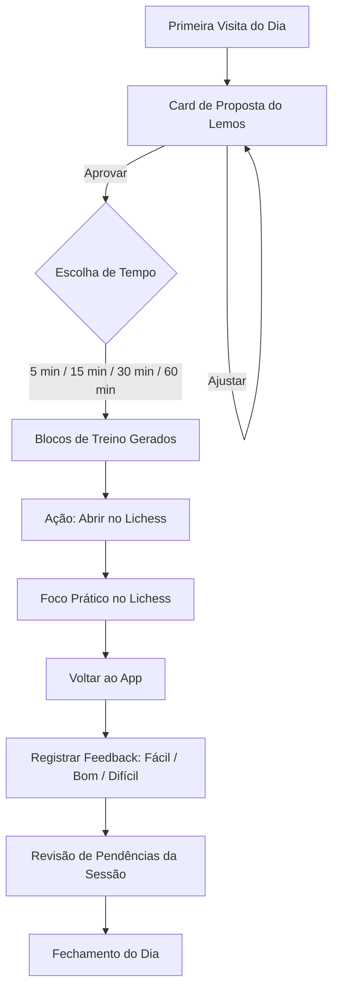

# Plano de Implementação do Método Lichess - GEMINI

Este documento estabelece o plano pedagógico e de experiência do usuário (UX) do aplicativo `lichess-tutor`. O foco é transformar as conclusões das auditorias e análises literárias em uma rotina prática e adaptativa no Lichess, utilizando o tom de voz do Professor Lemos.

---

## 1. Veredito Executivo

O sucesso do `lichess-tutor` reside em atuar como um **orquestrador inteligente e não intrusivo**. O aplicativo não tenta emular um tabuleiro nem duplicar os motores de jogo; em vez disso, ele atua como a mente analítica (o "Tutor") que diagnostica fraquezas, seleciona o percurso ideal de estudo e orienta o aluno a treinar diretamente no ecossistema do Lichess. 

A literatura acadêmica recente (Gevorgyan 2024, Zorić 2025) e a didática clássica nacional (Tirado & Silva 1999) convergem para um ponto: **a ilusão de competência é o maior obstáculo do enxadrista autodidata**. O plano a seguir elimina o estudo passivo e força o aluno a entrar em um fluxo constante de recuperação ativa e autorreflexão metacognitiva.

---

## 2. Princípio Pedagógico Central

* **Recuperação Ativa (Active Recall)**: Em vez de ler livros de aberturas ou assistir a vídeos passivamente, o aluno é colocado diante de problemas interativos (puzzles ou estudos com lances ocultos).
* **Reflexão sobre o Erro (Metacognição)**: Conforme a correlação empírica de Gevorgyan ($r=0.29$), o aprendizado se consolida quando o aluno analisa ativamente os exercícios que falhou em solucionar.
* **Carga Cognitiva Controlada**: Sessões curtas com tempo cronometrado (Time Budgeting do GM Rafael Leitão), focando em uma única fraqueza por ciclo de treino para evitar saturação.
* **Evitar a Ilusão de Competência**: A Stockfish (engine) é afastada do olhar direto do estudante. O progresso é medido por acertos em posições diagnósticas sem indicação de tema e pela capacidade de explicar a lógica do lance por trás da jogada.

---

## 3. Mapa Lichess do Método

A integração com o Lichess ocorre de forma estritamente documental e por redirecionamento cirúrgico de links, aproveitando a API pública e os recursos nativos:

### Studies
* **Mapeamento**: Criação automatizada de Lichess Studies privados via `POST /api/study` utilizando o escopo `study:write`.
* **Capítulos**: Inserção de posições de partidas jogadas pelo usuário (importadas via `POST /api/study/{studyId}/import-pgn`). Os capítulos são configurados no modo "Interactive Lesson" para ocultar os lances corretos e forçar a digitação na tela.

### Puzzle Themes
* **Mapeamento**: Links diretos para as páginas oficiais de temas específicos do banco do Lichess (ex: `/training/fork`, `/training/hangingPiece`, `/training/discoveredAttack`), acionados de acordo com a fraqueza detectada no diagnóstico.

### Puzzle Dashboard/Activity/Replay
* **Mapeamento**: Uso do escopo `puzzle:read` para puxar o histórico de puzzles recentes do usuário (via `/api/puzzle/activity`). Os IDs dos problemas falhados são agrupados temporariamente na memória local para alimentar o drill de "Tratamento de Pendências" e redirecionar para a página `/training/replay`.

### Practice/Learn/Analysis
* **Mapeamento**: Recomendações dos cursos interativos oficiais do Lichess:
  * `/practice` para mates elementares e finais básicos (lucena, philidor, oposição).
  * `/learn` para regras fundamentais.
  * `/analysis` de forma contida, apenas para autoanálise pós-partida, desativando a visualização da engine nas primeiras etapas.

---

## 4. Desenho das 5 Trilhas

### Trilha 1: Tratamento de Pendências
* **Promessa**: Eliminar erros repetitivos através da correção sistemática dos blunders cometidos em partidas e táticas anteriores.
* **Capítulos**: 
  1. *Meus Erros Recentes*: Posições reais onde o jogador cometeu capivara.
  2. *Replay de Tática*: Puzzles do Lichess falhados na última semana.
* **Ritual de Sessão**: O app exibe o aviso do Professor Lemos -> Redireciona para o Replay ou carrega a posição no Study -> O aluno tenta solucionar -> Se falhar, deve anotar localmente por que falhou antes de ver a resposta.
* **Pergunta-guia do Professor Lemos**: *"Qual sinal do tabuleiro você ignorou quando jogou o lance errado na partida real?"*
* **Destino Lichess**: `/training/replay` ou Study customizado de pendências.
* **Critério de Conclusão**: Resolver 5 posições anteriormente falhadas com sucesso no dia.
* **Risco Pedagógico**: O jogador chutar lances de forma impulsiva apenas para "limpar a fila", sem refletir sobre o erro.

### Trilha 2: Cálculo Ponte (800-1200)
* **Promessa**: Construir a antena tática do jogador, migrando do cálculo impulsivo para o escaneamento forçado de lances candidatos.
* **Capítulos**:
  1. *O Padrão Oculto*: Introdução teórica aos temas de mate em 2 e garfos.
  2. *Scan DAMP*: Exercícios mistos exigindo a aplicação sistemática de **Defesa, Alinhamento, Mobilidade e Promoção**.
* **Ritual de Sessão**: Antes de clicar, o aluno deve aplicar o DAMP nas peças do adversário -> Listar lances candidatos (Xeque, Captura, Ameaça) -> Calcular as linhas forçadas.
* **Pergunta-guia do Professor Lemos**: *"Quais peças adversárias estão soltas ou no mesmo alinhamento? Qual o lance forçado?"*
* **Destino Lichess**: `/training/fork` ou `/training/mateIn2`.
* **Critério de Conclusão**: Atingir $\ge 80\%$ de acerto em uma bateria de 10 puzzles mistos de cálculo.
* **Risco Pedagógico**: Focar em profundidade de cálculo desnecessária (linhas longas) e pendurar peças em um lance na primeira jogada (ignorar a segurança material básica).

### Trilha 3: Defesa Ativa
* **Promessa**: Desenvolver a resiliência mental e a profilaxia sob pressão, encontrando recursos defensivos ativos em posições de desvantagem.
* **Capítulos**:
  1. *A Ameaça Alheia*: Identificar o plano do oponente.
  2. *Resistência e Contra-ataque*: Posições com desvantagem material onde é preciso forçar o empate ou contra-atacar.
* **Ritual de Sessão**: O aluno examina o último lance do oponente -> Identifica a ameaça direta -> Lista lances de defesa (Fugir, Bloquear, Proteger ou Contra-atacar) -> Executa.
* **Pergunta-guia do Professor Lemos**: *"O que o seu oponente quer fazer no próximo lance? Como você pode estragar o plano dele?"*
* **Destino Lichess**: `/practice` (seção de King Safety e Defesa) ou Studies comunitários curados de profilaxia.
* **Critério de Conclusão**: Completar 4 exercícios de defesa sem selecionar lances puramente passivos.
* **Risco Pedagógico**: Saturação psicológica (o jogador desanimar e abandonar a posição por achar que está perdido).

### Trilha 4: Abertura Como Plano
* **Promessa**: Sobreviver à abertura jogando por conceitos estratégicos sólidos e desenvolvimento harmônico de peças, sem decorar linhas extensas.
* **Capítulos**:
  1. *O Centro e a Segurança*: Controle do centro, roque e desenvolvimento.
  2. *A Estrutura sugere o Plano*: Compreender o que fazer no meio-jogo a partir da cadeia de peões criada.
* **Ritual de Sessão**: O app abre o Study de Aberturas -> O aluno joga lances conceituais -> O app avisa se o desenvolvimento de peças ou a segurança do rei foi violada.
* **Pergunta-guia do Professor Lemos**: *"Essa jogada ajuda a desenvolver suas peças e proteger seu rei, ou é apenas um lance de peão sem motivo?"*
* **Destino Lichess**: Rota de princípios elementares de aberturas ou Lichess Studies temáticos de princípios de desenvolvimento.
* **Critério de Conclusão**: Completar os capítulos conceituais da abertura escolhida sem errar os lances baseados nos 3 princípios de desenvolvimento.
* **Risco Pedagógico**: O aluno cair na tentação de decorar sequências mecânicas de 15 lances em vez de entender o porquê de cada jogada.

### Trilha 5: Diplomas de Progresso
* **Promessa**: Validar a transição de bandas curriculares e certificar a assimilação de conhecimento sem depender de oscilações de rating.
* **Capítulos**:
  1. *Exame do Peão (0-600)*: Coordenadas, regras especiais, mates básicos.
  2. *Exame da Torre (600-1000)*: Tática mista, finais elementares de peões, checklist DAMP.
  3. *Exame do Rei (1000-1200)*: Princípios de abertura, finais técnicos essenciais (Capablanca/de la Villa).
* **Ritual de Sessão**: O app bloqueia a evolução -> Apresenta um teste fechado de 10-12 posições mistas e conceituais -> O aluno tem tempo fixo para resolver -> O app pontua.
* **Pergunta-guia do Professor Lemos**: *"Chegou a hora do teste de Diploma. Sem pressa e sem chutar. Você confia nas suas decisões?"*
* **Destino Lichess**: Lichess Study de avaliação privada do app (sem dicas nem temas rotulados).
* **Critério de Conclusão**: Pontuação $\ge 80\%$ (ou $\ge 90\%$ para o Peão) na bateria de testes para liberar a próxima banda.
* **Risco Pedagógico**: Ansiedade no teste ou uso de auxílio externo (motores de análise).

---

## 5. UX da Rotina



### Primeira Visita do Dia
Ao abrir o PWA, o usuário é saudado de forma direta e sem jargões infantilizados. A tela exibe o painel de consistência atual e metas acumuladas.

### Card de Proposta
Antes de exibir as tarefas práticas, o Professor Lemos apresenta a Proposta de Fase Curricular. O card descreve o foco atual (ex: *"Esta semana vamos focar na antena tática com garfos e na segurança material"*), a estimativa de tempo restante e o progresso até o próximo checkpoint (6h/12h/24h). O aluno pode aceitar ou pedir ajuste na tela Hoje.

### Blocos 5/15/30/60 min
Com o tempo escolhido, os blocos são listados em ordem didática lógica:
* *5 min*: 1 bloco curto (Aquecimento ou Tratamento de Pendências).
* *15 min*: Aquecimento (3 min) + Foco do Dia (12 min).
* *30 min*: Aquecimento (3 min) + Foco do Dia (20 min) + Finais Técnicos ou Pendências (7 min).
* *60 min*: Aquecimento (5 min) + Foco Principal (35 min) + Defesa/Estratégia (15 min) + Autoanálise/Transferência (5 min).

### Abrir Lichess
O botão de ação é um link real com `target="_blank"`. O clique aciona a gravação do log de início de estudo na IndexedDB antes de redirecionar para a página correta no Lichess.

### Voltar e Registrar Feedback
Ao terminar no Lichess, o aluno retorna ao app e clica em "Concluir". Ele é obrigado a avaliar a tarefa:
* *Fácil*: Acelera a transição do tema para repetições mistas.
* *Bom*: Mantém a curva planejada e introduz puzzles variados.
* *Difícil*: Retorna ao estágio de explicação guiada na próxima sessão.

### Revisão das Pendências
Se o bloco treinado for de puzzles, o card do Lemos habilita o botão "Conferir puzzles" para que a API puxe os resultados, detecte falhas recentes e as insira imediatamente na fila de pendências locais do jogador.

---

## 6. Microcopy Original (Voz do Professor Lemos)

* **Trilha de Pendências**:
  > *"Esqueça o rating por um momento. O seu maior adversário é o erro que você repete. Vamos olhar para aquelas posições que você pendurou ontem. Encontre o erro antes de tentar acertar o lance."*
* **Trilha de Cálculo**:
  > *"O tabuleiro não é uma corrida de velocidade. Antes de mover, escaneie os alvos: há peças soltas no ar? Existe algum alinhamento perigoso? Aplique o scan DAMP e depois calcule as respostas forçadas."*
* **Trilha de Defesa**:
  > *"Estar pior faz parte do jogo. O que define o bom enxadrista é a resiliência na desvantagem. Não entregue a partida e não jogue lances passivos. Qual é a ameaça real do seu oponente e como podemos incomodá-lo?"*
* **Trilha de Abertura**:
  > *"Não decore linhas. Entenda por que você move cada peça. Seu objetivo é controlar o centro, rocar o rei e colocar as peças menores para trabalhar de forma coordenada. O plano do meio-jogo nasce dessa harmonia."*

---

## 7. Diplomas de Progresso

| Diploma | Faixa | Temas Cobrados | Critério de Avanço |
| :--- | :--- | :--- | :--- |
| **Peão** | `0-600` | Coordenadas do tabuleiro, valor relativo das peças, regras especiais (roque, en passant, afogamento) e mates elementares de Dama e Torre. | Acerto de $\ge 90\%$ nas posições do teste interativo de fundamentos. |
| **Torre** | `600-1000` | Detecção tática mista (garfo, cravada, espeto, ataque descoberto), segurança material (LPDO) e finais elementares de peões (regra do quadrado, oposição). | Acerto de $\ge 80\%$ no teste sem dicas de temas rotulados. |
| **Rei** | `1000-1200` | Finais técnicos essenciais de torre (Lucena, Philidor), princípios gerais de abertura, checklist de lances candidatos e profilaxia elementar. | Acerto de $\ge 80\%$ em exame misto cronometrado de tomada de decisão. |

* **Regra de Revisão**: Se o jogador falhar no teste de um Diploma, o app bloqueia o avanço da banda curricular por 3 dias e prescreve blocos focados exclusivamente nos temas em que o jogador errou no teste, antes de permitir uma nova tentativa.

---

## 8. Regras de Adaptação Rotativa

O app calibra dinamicamente as tarefas baseando-se no desempenho real dos blocos e nos feedbacks subjetivos registrados:

```
[Acerto em Bateria de Puzzles / Teste]
  ├── >=80% ──> Tema dominado. Avança estágio (ex: Guided -> Retrieval) ou abre novo tema.
  ├── 50-79% ──> Consolidação. Mantém o tema no próximo dia em formato variado (Interleaving).
  └── <50% ───> Lacuna crítica. Recua estágio (ex: Retrieval -> Guided) e prioriza no plano.

[Feedback Subjetivo do Jogador]
  ├── Fácil ───> Acelera progressão e reduz número de sessões dedicadas ao tema puro.
  ├── Bom ─────> Mantém a curva curricular padrão projetada.
  └── Difícil ─> Reduz complexidade. Insere explicações simples e Worked Examples.
```

### Novo vs Revisão
O app mantém um balanço de **70% de conteúdo novo** e **30% de revisão** (Tratamento de Pendências e repetição espaçada) para evitar sobrecarga cognitiva e reter os padrões táticos na memória de longo prazo de forma sólida.

---

## 9. Privacidade e Clean-Room

* **Sem Persistência de PGN completo**: O aplicativo processa PGNs de partidas de forma transiente na memória para extrair estatísticas de erros e sinais, descartando-os imediatamente e guardando apenas as coordenadas do erro e a fraqueza apontada.
* **Token Local Seguro**: O token OAuth (`study:write` / `puzzle:read`) é armazenado exclusivamente no IndexedDB local do navegador, nunca sendo enviado a servidores externos, logs ou exposto em backups de arquivos JSON compartilhados.
* **Sem Cópia de Conteúdo sob Direitos Autorais**: O banco de dados do app não conterá posições de livros patenteados. Os estudos do Lichess criados dinamicamente utilizam apenas as partidas reais do próprio usuário ou posições clássicas de domínio público como base de treino.

---

## 10. Testes Pedagógicos e Sinais de Qualidade

Para garantir a precisão pedagógica das intervenções do tutor adaptativo, o app verifica:
* **Taxa de Blunder local pós-treino**: Mede se os erros do tipo *Hanging Piece* ou *Fork* diminuíram nas partidas jogadas no Chess.com/Lichess nas 48 horas seguintes a um treino focado nesses temas.
* **Tempo de Resolução**: Monitoramento do tempo de resposta local para identificar se a reação do jogador a determinados padrões táticos está se tornando intuitiva.
* **Validador de Links do Catálogo**: Scripts automáticos de CI executam varreduras periódicas (com cadence de 30 dias) nos links comunitários integrados do Lichess para evitar que o aluno caia em páginas de erro 404.

---

## 11. Fases de Implementação (Roteiro Codex)

* **Fase 1: Estrutura Curricular e Tipos**:
  * Adicionar os marcos de progresso e tipos de diplomas em `src/domain/types.ts`.
  * Atualizar a metodologia consolidada em `docs/pedagogy/metodo-consolidado-acervo-2026-06-09.md`.
* **Fase 2: Calibração do Gerador de Planos**:
  * Ajustar `src/domain/plan/generatePlan.ts` para integrar o drill de Tratamento de Pendências com prioridade quando forem encontrados erros de tática e cálculo.
* **Fase 3: Catálogo e Blocos de Treino**:
  * Adicionar os novos blocos de progresso e marcos de avaliação (Diplomas do Peão, Torre e Rei) em `src/trainingBlocks.ts` utilizando a microcopy adaptada do Professor Lemos.
* **Fase 4: Validação de Testes Unitários**:
  * Cobrir as regras de avanço por diplomas e bloqueios de revisão com testes unitários em `src/domain/plan/generatePlan.test.ts`.

---

## 12. Notas Comparativas

* **Nota para Impacto**: **9.5/10**. A orquestração das 5 trilhas e os Diplomas baseados em avaliações locais mudam materialmente o comportamento do app, oferecendo uma progressão didática profissional sem focar em números frios de rating.
* **Nota para Esforço**: **6.0/10**. O esforço de código é contido porque a infraestrutura de Dexie, IndexedDB e chamadas de API do Lichess já está estabilizada e testada no app.
* **Nota para Risco**: **3.0/10**. Baixo risco técnico. A conformidade clean-room é mantida por não armazenar conteúdo de livros no app, apenas redirecionar para links legítimos do Lichess.
* **Nota para Prioridade**: **9.0/10**. Altamente prioritário para consolidar o Professor Lemos como um tutor educacional robusto e maduro para o usuário no uso diário do app.

---

## 13. Perguntas Abertas

1. **Quantos puzzles falhados o Lichess mantém no replay de atividade?** A API pública impõe limites de histórico que precisamos documentar em `docs/research/sources.md` para garantir que o "Tratamento de Pendências" não perca posições antigas de erros se o usuário passar muitas semanas sem sincronizar.
2. **Como estruturar o PGN do Teste do Peão no Study do dia de forma 100% dinâmica?** Precisamos mapear se a API do Lichess aceita a criação de capítulos interativos com perguntas textuais em português sem quebrar a renderização mobile.

---

## 14. Recomendação Final

Recomenda-se que o Codex execute a implementação deste plano pedagógico em pequenos commits atômicos, iniciando pelas alterações de tipagem em `src/domain/types.ts` e pelas definições do gerador em `generatePlan.ts`. O ritual de testes automatizados (`npm run test`) deve ser executado a cada passo para garantir estabilidade contínua na transição de fases.
