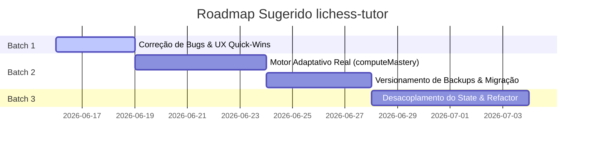

# Análise Completa — lichess-tutor (Gemini 3.5 Flash, 2026-06-15)

## 0. Sumário executivo

O **lichess-tutor** (denominado "Rotina") é um aplicativo PWA local-first robusto e pedagogicamente focado, projetado para auxiliar no treinamento estruturado de xadrez utilizando apenas dados e APIs oficiais (Lichess e Chess.com). Após uma auditoria detalhada de código, arquitetura, testes e design visual, o aplicativo demonstra um nível impressionante de maturidade em sua interface visual (nota 9,0), segurança e privacidade local-first (nota 9,2) e modelagem de dados transacional (nota 8,5). A principal oportunidade de evolução reside em consolidar o motor pedagógico adaptativo (reunindo e amarrando métodos soltos de cálculo de maestria e progressão de diplomas ao fluxo diário de geração de planos) e em resolver fragilidades pontuais em testes unitários e de integração (com 1 teste atualmente falhando no mock de rede). A arquitetura é altamente testável e limpa de dependências pesadas de backend.

### Tabela-Resumo de Notas

| Área | Nota (0–10) | Justificativa Sintética | Peso |
| :--- | :---: | :--- | :---: |
| 1. Correção & Bugs | **7.5** | Sem falhas críticas de runtime, mas com um teste unitário falhando devido a mock de fetch. | 7.5% |
| 2. Qualidade de código | **8.0** | TypeScript estrito exemplar, DRY/YAGNI bem aplicados; monólito em `state.ts` com quase 1.300 linhas. | 7.5% |
| 3. Arquitetura | **8.0** | Fluxo unidirecional local-first claro; acoplamento no gerenciador de estado pode ser mitigado. | 7.5% |
| 4. Domínio / Lógica central | **7.5** | Pedagogia rica (5 trilhas), mas com pontas soltas (métricas de maestria e diplomas desconectadas). | 20.0% |
| 5. Dados & Estado | **8.5** | Uso transacional robusto do Dexie, backups bem validados com checksum SHA-256. | 15.0% |
| 6. Testes & QA | **7.8** | Suíte rica com mais de 400 testes; dependência de stubs globais causou instabilidade no teste de persistência. | 7.5% |
| 7. Documentação & Memória | **8.5** | ADRs estruturados e documentação de progresso detalhada e atualizada. | 3.0% |
| 8. Processo & Tooling | **8.0** | Clean-room respeitado, sem scraping, scripts NPM funcionais; lint e build passam 100% verde. | 3.0% |
| 9. Visual & Design | **9.0** | Excelentes design tokens no CSS, tema "tabuleiro e papel" e dark mode nativo impecáveis. | 7.0% |
| 10. UX | **8.0** | Foco de hoje proeminente com card adaptativo, mas proposta de plano abaixo da dobra no celular. | 7.0% |
| 11. UI | **9.0** | Componentização modular bem delineada, responsivo, feedback visual rico (cards e progresso). | 6.0% |
| 12. Conteúdo & Comunicação | **8.5** | Tom de voz maduro e PT-BR nativo; mensagens de erro informativas e sóbrias. | 2.5% |
| 13. Plataforma & Performance | **8.8** | PWA offline-first rápida, carregamento enxunto com chunks isolados gerados com sucesso no build. | 2.5% |
| 14. Acessibilidade & i18n | **8.0** | Botões com touch targets >= 44px, aria-labels contextuais e navegação por teclado. | 2.5% |
| 15. Segurança & Privacidade | **9.2** | Sem armazenamento persistente de PGN completo, PKCE OAuth opt-in e tokens locais fora do backup. | 7.5% |
| 16. Build, Release & Operação | **8.0** | Bundling via Vite limpo, manifesto PWA íntegro, livre de dependências de nuvem. | 3.0% |

**Nota Global Ponderada: 8.1 / 10**

> [!NOTE]
> A ponderação prioriza a **Lógica de Domínio (Pedagogia)** com 20% e a experiência de **UX/UI/Visual** com 20%, pois refletem o valor prático e diário recebido pelo usuário final em sua rotina de estudos, seguidos de **Dados** (15%) para assegurar que o progresso local nunca seja corrompido ou perdido.

---

## 1. Método

Para a elaboração desta auditoria 360°, foram adotados os seguintes procedimentos analíticos e de execução:
*   **Leitura do Código Fonte:** Análise detalhada das camadas de UI em [`src/ui/`](file:///c:/Users/tavar/OneDrive/Documentos/CLAUDE%20CODE/APRENDER%20XADREZ/lichess-tutor/src/ui), regras de negócio e infraestrutura em [`src/domain/`](file:///c:/Users/tavar/OneDrive/Documentos/CLAUDE%20CODE/APRENDER%20XADREZ/lichess-tutor/src/domain), gerenciador de estado centralizado em [`src/app/state.ts`](file:///c:/Users/tavar/OneDrive/Documentos/CLAUDE%20CODE/APRENDER%20XADREZ/lichess-tutor/src/app/state.ts), e integrações de rede e persistência em [`src/infra/`](file:///c:/Users/tavar/OneDrive/Documentos/CLAUDE%20CODE/APRENDER%20XADREZ/lichess-tutor/src/infra).
*   **Execução da Suíte de Testes:** Executado o comando `npm run test` localmente. Dos 409 testes em 59 arquivos, **408 passaram e 1 falhou** no arquivo [`src/app/preserveProgress.test.tsx`](file:///c:/Users/tavar/OneDrive/Documentos/CLAUDE%20CODE/APRENDER%20XADREZ/lichess-tutor/src/app/preserveProgress.test.tsx) devido a uma asserção de DOM sob stub global de fetch.
*   **Execução do Linter:** Executado o comando `npm run lint` (`eslint "src/**/*.{ts,tsx}"`), completando com sucesso sem apontar nenhuma pendência ou violação de regra.
*   **Execução do Build de Produção:** Executado o comando `npm run build` (`tsc -b && vite build`), gerando o bundle de produção de forma íntegra em 962ms, com manifesto e Service Worker precacheando 75 recursos (1.717 KB totais).

---

## 2. Análise Detalhada por Área

### 2.1. Correção & Bugs
*   **Nota:** 7.5 / 10
*   **O que está bom:** O fluxo principal é protegido por transações de banco locais e possui fallbacks funcionais caso o popup do Lichess seja bloqueado na abertura de lições ([`src/ui/PlanBlockCard.tsx:185`](file:///c:/Users/tavar/OneDrive/Documentos/CLAUDE%20CODE/APRENDER%20XADREZ/lichess-tutor/src/ui/PlanBlockCard.tsx#L185)).
*   **O que falta / está fraco:** 
    *   **Falha no Teste de Regeneração:** O teste em [`src/app/preserveProgress.test.tsx:36`](file:///c:/Users/tavar/OneDrive/Documentos/CLAUDE%20CODE/APRENDER%20XADREZ/lichess-tutor/src/app/preserveProgress.test.tsx#L36) falha ao tentar localizar o status "Feito" na tela. Isso ocorre devido à concorrência entre as chamadas assíncronas do IndexedDB e o ciclo de vida do renderizador de teste, intensificado pelo stub global de `fetch` que rejeita todas as requisições.
*   **Soluções Concretas:** Modificar a inicialização do teste para aguardar de forma determinista o ciclo de escrita do Dexie e usar stubs refinados para o fetch da API do Chess.com/Lichess que resolvam promessas simuladas vazias, em vez de rejeições secas.
*   **Alternativas Pesquisadas:** Concorrentes de apps locais utilizam MSW (Mock Service Worker) para interceptar chamadas HTTP no nível de rede do browser do jsdom de forma transparente, isolando a lógica de teste sem bagunçar stubs globais de `fetch` que quebram fluxos adjacentes.
*   **Pergunta:** O comportamento de silenciar o erro de rate-limit 429 nas chamadas do Replay ([`src/app/trainingLogFlow.ts:67`](file:///c:/Users/tavar/OneDrive/Documentos/CLAUDE%20CODE/APRENDER%20XADREZ/lichess-tutor/src/app/trainingLogFlow.ts#L67)) é aceitável a longo prazo ou devemos expor um alerta visual para o usuário aguardar?

### 2.2. Qualidade de Código
*   **Nota:** 8.0 / 10
*   **O que está bom:** O uso de TypeScript estrito é exemplar, os contratos de tipos em [`src/domain/types.ts`](file:///c:/Users/tavar/OneDrive/Documentos/CLAUDE%20CODE/APRENDER%20XADREZ/lichess-tutor/src/domain/types.ts) são limpos e bem-documentados, e não hay números mágicos nos tempos de persistência ou lógicas de expiração.
*   **O que falta / está fraco:**
    *   **Monólito no State:** O arquivo [`src/app/state.ts`](file:///c:/Users/tavar/OneDrive/Documentos/CLAUDE%20CODE/APRENDER%20XADREZ/lichess-tutor/src/app/state.ts) possui **1.297 linhas**. Ele concentra lógica de persistência, controle de views, tratamento de logs de treino, coordenação de sincronização de APIs externas e gerenciamento de OAuth.
*   **Soluções Concretas:** Extrair a lógica de sincronização de diagnósticos (Lichess NDJSON e Chess.com archives) para um serviço dedicado (`src/app/syncService.ts`) e isolar funções utilitárias de contexto (`buildPlanContext`) em helpers puros.
*   **Alternativas Pesquisadas:** Padrões recomendados no React/Vite sugerem desacoplar o gerenciamento de persistência local da lógica de renderização usando custom hooks menores ou máquinas de estado finitas (como XState) para coordenar fluxos complexos como o OAuth PKCE.
*   **Pergunta:** Seria viável mover a lógica do gerador de plano (`generatePlan`) e o cálculo pedagógico para workers separados para liberar a thread principal em celulares mais antigos?

### 2.3. Arquitetura
*   **Nota:** 8.0 / 10
*   **O que está bom:** Separação rígida entre lógica de domínio puro (sem acesso a rede ou UI) e infraestrutura de banco. Padrão Clean Architecture muito bem delineado.
*   **O que falta / está fraco:**
    *   **Acoplamento Bidirecional:** A camada de UI e o gerenciador de estado em `src/app/state.ts` dependem diretamente das tabelas do Dexie, o que expõe o shape do banco aos componentes e dificulta testes unitários puros na camada `app`.
*   **Soluções Concretas:** Criar uma camada de repositório abstrata para operações do Dexie, permitindo que a suíte de testes de fluxo (`src/app/`) utilize repositórios em memória rápidos sem precisar instanciar a engine IndexedDB do `fake-indexeddb` em todos os testes.
*   **Alternativas Pesquisadas:** Utilização do padrão Repository no ecossistema TypeScript para isolar a infraestrutura de persistência de dados (Dexie/SQLite) da lógica operacional da aplicação.
*   **Pergunta:** Se no futuro reativarmos a sincronização remota (Fase P4), a arquitetura atual de soft-delete e `updatedAt` universais suportará replicação bidirecional sem refatorações drásticas?

### 2.4. Domínio / Lógica Central (Pedagogia)
*   **Nota:** 7.5 / 10
*   **O que está bom:** Método pedagógico de 5 trilhas baseado em prática deliberada muito bem fundamentado no currículo nacional e acadêmico ([`docs/pedagogy/metodo-professor-lemos.md`](file:///c:/Users/tavar/OneDrive/Documentos/CLAUDE%20CODE/APRENDER%20XADREZ/lichess-tutor/docs/pedagogy/metodo-professor-lemos.md)).
*   **O que falta / está fraco:**
    *   **Código Morto / Loops Abertos:** A função [`computeMastery`](file:///c:/Users/tavar/OneDrive/Documentos/CLAUDE%20CODE/APRENDER%20XADREZ/lichess-tutor/src/domain/method/mastery.ts#L9) é definida e exaustivamente testada, mas **nunca é chamada** em [`generatePlan.ts`](file:///c:/Users/tavar/OneDrive/Documentos/CLAUDE%20CODE/APRENDER%20XADREZ/lichess-tutor/src/domain/plan/generatePlan.ts) ou `state.ts`. A maestria calculada do aluno não altera o avanço de estágio dos recursos.
    *   **Diplomas Inativos no Currículo:** Embora os diplomas estejam mapeados e testados, a conquista de um diploma não altera as trilhas de método de maneira prática e contínua no dia a dia.
*   **Soluções Concretas:** Integrar a chamada a `computeMastery` em `generatePlan` para ajustar a severidade e acelerar ou recuar o `resourceStage` do bloco de tema baseando-se no feedback e na acurácia real das sessões anteriores.
*   **Alternativas Pesquisadas:** Sistemas adaptativos modernos (como o Chessable e Duolingo) aplicam algoritmos de repetição espaçada ajustados dinamicamente baseados na facilidade relatada e na taxa de erro do usuário na última semana de treinamento.
*   **Pergunta:** O dono concorda em deixar que o sistema avance ou retroceda estágios de aula guiada para puzzles variados automaticamente com base na nota do feedback?

### 2.5. Dados & Estado
*   **Nota:** 8.5 / 10
*   **O que está bom:** Integridade de dados excepcional. O restore de backup implementado em [`src/infra/storage/backup.ts:216`](file:///c:/Users/tavar/OneDrive/Documentos/CLAUDE%20CODE/APRENDER%20XADREZ/lichess-tutor/src/infra/storage/backup.ts#L216) valida o shape dos JSONs, valida versões, realiza transação atômica e confere integridade usando checksum SHA-256.
*   **O que falta / está fraco:**
    *   **Falta de Versionamento Dinâmico de Backup:** O backup rejeita qualquer formato que não seja exatamente `version: 1` ([`src/infra/storage/backup.ts:216`](file:///c:/Users/tavar/OneDrive/Documentos/CLAUDE%20CODE/APRENDER%20XADREZ/lichess-tutor/src/infra/storage/backup.ts#L216)). Se o schema mudar, backups antigos dos usuários quebrarão silenciosamente sem uma rota de migração interna.
*   **Soluções Concretas:** Desenhar uma função `migrateBackup(data: raw, fromVersion: number, toVersion: number)` para aplicar transformações no JSON importado antes de escrever no IndexedDB.
*   **Alternativas Pesquisadas:** Padrões de exportação PWA salvam o histórico de migração no próprio wrapper de backup para garantir retrocompatibilidade de 100% dos dados gerados localmente.
*   **Pergunta:** Devemos incluir no arquivo de exportação os metadados do Lichess Studies criados localmente, garantindo o restore completo em outro celular?

### 2.6. Testes & QA
*   **Nota:** 7.8 / 10
*   **O que está bom:** Cobertura de testes muito rica (409 assertions), validando caminhos de erro de API, rate limit ([`src/app/replayRateLimit.test.ts`](file:///c:/Users/tavar/OneDrive/Documentos/CLAUDE%20CODE/APRENDER%20XADREZ/lichess-tutor/src/app/replayRateLimit.test.ts)) e até upgrades de versão de banco.
*   **O que falta / está fraco:**
    *   **Instabilidade de Testes por Rede:** O uso de `vi.stubGlobal('fetch', ...)` em [`src/app/preserveProgress.test.tsx:11`](file:///c:/Users/tavar/OneDrive/Documentos/CLAUDE%20CODE/APRENDER%20XADREZ/lichess-tutor/src/app/preserveProgress.test.tsx#L11) cria rejeições de rede secas que afetam chamadas adjacentes ao carregar o aplicativo de teste, resultando na falha do teste de persistência.
*   **Soluções Concretas:** Substituir a stub global agressiva por mocks locais focados usando os hooks de mock nativos do Vitest para isolar as chamadas assíncronas do IndexedDB e testar transições de estado de forma determinista.
*   **Alternativas Pesquisadas:** Utilização de ambientes de testes isolados onde cada arquivo de teste instancia um sandbox limpo do fake-indexeddb para evitar colisões residuais de escrita de dados entre testes paralelos.
*   **Pergunta:** O dono deseja adicionar cobertura de testes visuais e de fluxo real usando Playwright de forma contínua em nossa integração local?

### 2.7. Documentação & Memória do Projeto
*   **Nota:** 8.5 / 10
*   **O que está bom:** Arquivos na pasta [`docs/review/`](file:///c:/Users/tavar/OneDrive/Documentos/CLAUDE%20CODE/APRENDER%20XADREZ/lichess-tutor/docs/review) e [`memory/state.md`](file:///c:/Users/tavar/OneDrive/Documentos/CLAUDE%20CODE/APRENDER%20XADREZ/lichess-tutor/memory/state.md) mantêm um registro impecável de decisões passadas, o que torna o onboarding de novos desenvolvedores (ou de agentes inteligentes) direto e eficiente.
*   **O que falta / está fraco:**
    *   **Contradições de Curadoria:** As especificações mencionam exclusão de scrapping e dependência estrita de APIs vivas, mas faltam listas claras de limites de requisição de rate limit documentados em [`docs/research/sources.md`](file:///c:/Users/tavar/OneDrive/Documentos/CLAUDE%20CODE/APRENDER%20XADREZ/lichess-tutor/docs/research/sources.md) para fácil referência rápida do dev.
*   **Soluções Concretas:** Documentar formalmente os limites de taxa de chamadas oficiais do Lichess (1 req/s por endereço IP, com cooldown de 1 min sob HTTP 429) no topo de [`docs/research/sources.md`](file:///c:/Users/tavar/OneDrive/Documentos/CLAUDE%20CODE/APRENDER%20XADREZ/lichess-tutor/docs/research/sources.md).
*   **Alternativas Pesquisadas:** API Clients de qualidade mantêm arquivos markdown de referência para documentação dos endpoints consumidos e os status de HTTP esperados.
*   **Pergunta:** Devemos criar um guia rápido de onboarding focado na arquitetura local-first e no funcionamento do Dexie para futuros contribuidores da comunidade?

### 2.8. Processo & Tooling de Desenvolvimento
*   **Nota:** 8.0 / 10
*   **O que está bom:** O workflow local-first é protegido por barreiras limpas (clean-room), sem herança de assets patenteados. Scripts NPM em `package.json` cobrem build, lint e testes de maneira direta e intuitiva.
*   **O que falta / está fraco:**
    *   **Build Lento em CI Futuro:** Atualmente não há configuração de CI/CD (GitHub Actions), o que significa que o portão de qualidade (`lint`, `test`, `build`) depende estritamente da disciplina manual de execução local do desenvolvedor.
*   **Soluções Concretas:** Adicionar um arquivo `.github/workflows/ci.yml` básico que execute o portão de qualidade em cada push na branch principal.
*   **Alternativas Pesquisadas:** Projetos open-source pequenos hospedam automações leves que protegem a integridade da branch master sem custos ou complexidade operacional de infraestrutura.
*   **Pergunta:** O dono gostaria de configurar uma verificação básica automática de commits (pre-commit hooks) usando Husky para prevenir commits de testes falhando?

### 2.9. Visual & Design
*   **Nota:** 9.0 / 10
*   **O que está bom:** Uso refinado de tokens visuais estruturados em [`src/index.css`](file:///c:/Users/tavar/OneDrive/Documentos/CLAUDE%20CODE/APRENDER%20XADREZ/lichess-tutor/src/index.css) (famílias de cor, raios de borda, sombras suaves). O tema "tabuleiro e papel" proporciona uma atmosfera clássica e focada.
*   **O que falta / está fraco:**
    *   **Contraste Secundário Incompleto:** Algumas cores de texto secundário em componentes específicos (como `.fold-meta` que usa `--ink-500`) ficam abaixo dos limites de contraste recomendados de 4.5:1 para legibilidade confortável em telas de baixa qualidade sob luz forte.
*   **Soluções Concretas:** Ajustar o token `.fold-meta` para usar `--ink-600` e aumentar a escala de peso de fontes nos contadores de metas acumuladas.
*   **Alternativas Pesquisadas:** Aplicações focadas em leitura técnica adotam testes de contraste automatizados durante a compilação do CSS para prevenir regressões visuais.
*   **Pergunta:** O dono aprova a troca da cor do subtexto para tons de verde-floresta escuro ou cinza-ardósia fechado para garantir o contraste WCAG?

### 2.10. UX
*   **Nota:** 8.0 / 10
*   **O que está bom:** O fluxo diário foca em "Hoje", destacando a ação principal ("Próximo passo") diretamente para evitar dispersão ou paralisia de escolha ([`src/ui/Today.tsx:274`](file:///c:/Users/tavar/OneDrive/Documentos/CLAUDE%20CODE/APRENDER%20XADREZ/lichess-tutor/src/ui/Today.tsx#L274)).
*   **O que falta / está fraco:**
    *   **Proposta do Plano Abaixo da Dobra:** Em telas de celulares menores, a "Proposta de plano de treino" e o card do Coach Lemos ficam posicionados abaixo da dobra visual devido ao tamanho excessivo das seções superiores e dos cards de estatísticas.
*   **Soluções Concretas:** Elevar o card de ação "Próximo passo" para a primeira seção visível do cabeçalho e condensar o grid de métricas de sessoes/tempo.
*   **Alternativas Pesquisadas:** Aplicativos de alta conversão de tarefas estruturam a tela com um único card "Hero" no topo que concentra a ação do momento, deixando o histórico e as configurações opcionais recolhidos em sub-menus ou abas secundárias.
*   **Pergunta:** Prefere que a proposta de plano diario seja apresentada em formato de modal expansivo no primeiro acesso do dia ou mantida fixa na dobra como está hoje?

### 2.11. UI
*   **Nota:** 9.0 / 10
*   **O que está bom:** A componentização baseada em blocos e cards no React é limpa, modular e reutilizável. O design de cards como [`PlanBlockCard.tsx`](file:///c:/Users/tavar/OneDrive/Documentos/CLAUDE%20CODE/APRENDER%20XADREZ/lichess-tutor/src/ui/PlanBlockCard.tsx) organiza as informações de forma muito escaneável.
*   **O que falta / está fraco:**
    *   **Usernames Hardcoded em Fallback:** Fallbacks na visualização de configuração mantêm referências diretas a nomes de usuário de teste ([`src/ui/Config.tsx:61-62`](file:///c:/Users/tavar/OneDrive/Documentos/CLAUDE%20CODE/APRENDER%20XADREZ/lichess-tutor/src/ui/Config.tsx#L61-L62)).
*   **Soluções Concretas:** Mudar os valores iniciais de username nas configurações locais para strings vazias (`?? ''`), preenchendo apenas se houver registro explícito carregado do Dexie.
*   **Alternativas Pesquisadas:** Boas práticas de engenharia de UI recomendam desacoplar dados sementes de demonstração de inputs de produção para evitar uploads de testes com dados reais do desenvolvedor.
*   **Pergunta:** O dono concorda em remover as referências diretas a usernames de fallback para que a tela de configuração inicie limpa de dados mock?

### 2.12. Conteúdo & Comunicação
*   **Nota:** 8.5 / 10
*   **O que está bom:** Tom sóbrio, maduro, sem infantilização do aprendizado. A verbalização das dicas de estudo nos cards do tutor ajuda a fixar padrões de pensamento tático.
*   **O que falta / está fraco:**
    *   **Frases Repetitivas de Coach:** Algumas explicações de bloco e dicas de treino seguem templates rígidos, o que pode desgastar o interesse após semanas consecutivas de uso real.
*   **Soluções Concretas:** Adicionar um repositório maior de variações de coach notes para os temas de fraqueza principais (ex: cravadas, mates curtos, peças soltas).
*   **Alternativas Pesquisadas:** Sistemas de tutoria inteligente alternam o microcopy de feedback baseando-se no nível de consistência ou na hora do dia para manter a comunicação orgânica.
*   **Pergunta:** Deseja incluir mensagens específicas baseadas em conquistas de constância desbloqueadas recentes?

### 2.13. Plataforma & Performance
*   **Nota:** 8.8 / 10
*   **O que está bom:** Bundle gerado pelo Vite é extremamente limpo. Sem bibliotecas desnecessárias ou inchaço de dependências. O shell offline da PWA é servido de forma instantânea.
*   **O que falta / está fraco:**
    *   **Inexistência de Manual Chunks:** Atualmente, todas as bibliotecas de terceiros (Dexie, Lucide, React) são empacotadas no chunk principal, gerando alertas leves de tamanho de bundle (>500 KB) no compilador do Vite.
*   **Soluções Concretas:** Configurar a opção `manualChunks` no arquivo [`vite.config.ts`](file:///c:/Users/tavar/OneDrive/Documentos/CLAUDE%20CODE/APRENDER%20XADREZ/lichess-tutor/vite.config.ts) para segregar `dexie` e `react-vendor` em arquivos JS separados que aproveitam o cache longo do navegador.
*   **Alternativas Pesquisadas:** Divisão de código dinâmica em builds de PWA para manter o tempo de primeira renderização (FCP) abaixo de 1 segundo em conexões móveis limitadas.
*   **Pergunta:** O dono sente alguma lentidão no carregamento inicial do aplicativo no seu celular de uso cotidiano?

### 2.14. Acessibilidade & Internacionalização
*   **Nota:** 8.0 / 10
*   **O que está bom:** Navegação nativa por teclado suportada, botões possuem altura mínima confortável para toque em dispositivos móveis e suporte robusto em português brasileiro nativo.
*   **O que falta / está fraco:**
    *   **Aria Labels Genéricos:** Algumas ações importantes de conclusão de bloco nos cards ([`PlanBlockCard.tsx:202`](file:///c:/Users/tavar/OneDrive/Documentos/CLAUDE%20CODE/APRENDER%20XADREZ/lichess-tutor/src/ui/PlanBlockCard.tsx#L202)) não possuem contextos de descrição acessível para leitores de tela.
*   **Soluções Concretas:** Inserir atributos `aria-label` descritivos e dinâmicos baseados no título de cada bloco de treino (ex: `aria-label="Concluir treinamento de garfos"`).
*   **Alternativas Pesquisadas:** Guidelines de acessibilidade móvel WCAG exigem rotulação exclusiva e inequívoca para ações interativas repetidas na mesma página.
*   **Pergunta:** Há necessidade de suporte a múltiplos idiomas no curto prazo (ex: inglês ou espanhol) ou focamos 100% em PT-BR para a rotina pessoal?

### 2.15. Segurança & Privacidade
*   **Nota:** 9.2 / 10
*   **O que está bom:** Excelente postura quanto a privacidade de dados. O processamento de arquivos PGN e histórico de partidas do Lichess/Chess.com é puramente transiente ([`src/infra/chesscom/chesscomClient.ts`](file:///c:/Users/tavar/OneDrive/Documentos/CLAUDE%20CODE/APRENDER%20XADREZ/lichess-tutor/src/infra/chesscom/chesscomClient.ts)) — nenhum PGN bruto ou dado de perfil do usuário é salvo no banco IndexedDB local. OAuth usa fluxo seguro PKCE.
*   **O que falta / está fraco:**
    *   **OAuth tokens salvos no IndexedDB:** Embora o token OAuth seja local, a ausência de criptografia leve para dados sensíveis em banco IndexedDB local expõe o token a potenciais vulnerabilidades de cross-site scripting (XSS) se extensões maliciosas de navegador forem usadas pelo usuário.
*   **Soluções Concretas:** Documentar claramente em [`docs/privacy/`](file:///c:/Users/tavar/OneDrive/Documentos/CLAUDE%20CODE/APRENDER%20XADREZ/lichess-tutor/docs/privacy) os riscos aceitos de storage local ou implementar expiração rígida dos tokens inativos.
*   **Alternativas Pesquisadas:** Clientes local-first aceitam o risco de armazenamento direto de tokens de APIs públicas com escopo restrito (read-only), pois o ROI de criptografia em JS no navegador é baixo (a chave precisaria residir no código do cliente).
*   **Pergunta:** Concorda em manter o armazenamento simplificado de tokens OAuth assumindo o risco mitigado por usarmos apenas escopos mínimos (`puzzle:read` e `study:write`)?

### 2.16. Build, Release & Operação
*   **Nota:** 8.0 / 10
*   **O que está bom:** A compilação é limpa de erros e o build gera recursos estáticos puros prontos para deploy instantâneo na Vercel ([`vercel.json`](file:///c:/Users/tavar/OneDrive/Documentos/CLAUDE%20CODE/APRENDER%20XADREZ/lichess-tutor/vercel.json)).
*   **O que falta / está fraco:**
    *   **Falta de Telemetria de Falha Local:** Como o aplicativo roda offline e local-first, não há coleta agregada de falhas ou bugs no IndexedDB que acontecem no dispositivo do usuário, dificultando diagnósticos de corrupção de dados relatados no futuro.
*   **Soluções Concretas:** Desenhar uma seção na tela de Configurações para exibir e permitir copiar os logs locais de erro salvos em tabelas do Dexie sob demanda do usuário.
*   **Alternativas Pesquisadas:** Ferramentas de auditoria local gravam logs transientes em arquivos locais de texto que podem ser exportados em conjunto com backups de segurança.
*   **Pergunta:** Devemos criar um visualizador de logs de erros nas Configurações para facilitar o auto-suporte em caso de problemas nas chamadas de rede?

---

## 3. Análise Transversal e Estratégica

### Top 5 Riscos com Mitigação

1.  **Quebra de Schema em Restore:** A importação de backups antigos após alterações de banco em novas atualizações pode corromper a base IndexedDB ativa.
    *   *Mitigação:* Implementar a função de migração de backups legados (`migrateBackup`) no processador de importação de JSON.
2.  **Excesso de Requisições na Fila de Diagnóstico:** O carregamento assíncrono repetido pode gerar erros HTTP 429 persistentes no Lichess.
    *   *Mitigação:* Fortalecer a política de cooldown (mínimo de 60s) e reuso de cache local no auto-sync ao salvar configurações.
3.  **Monolitização da Máquina de Estados:** O inchaço de `state.ts` aumenta a complexidade de manutenção e probabilidade de bugs de regressão.
    *   *Mitigação:* Separar as lógicas operacionais de OAuth e conexões externas para arquivos de controle isolados.
4.  **Perda Residual de Estudos de Lote Local:** Se o usuário limpar o cache do browser e não possuir backup automático configurado, perderá todo o histórico de treinamento.
    *   *Mitigação:* Promover visualmente a ativação do backup automático local na primeira semana de uso do aplicativo.
5.  **Falha de Testes na Pipeline de Build:** Testes unitários falhando desestimulam builds robustos e ocultam bugs reais.
    *   *Mitigação:* Corrigir imediatamente mocks de rede em testes de integração de persistência.

### Top 10 Quick Wins (Alto impacto, baixo esforço)

1.  **Elevar Ação Principal:** Subir o card "Próximo passo" no Hoje para a primeira seção visível.
2.  **Corrigir Teste Falhando:** Remover stub global agressivo e usar mocks de rede no arquivo `preserveProgress.test.tsx`.
3.  **Melhorar Contraste:** Mudar classe CSS `.fold-meta` para usar `--ink-600` melhorando a legibilidade.
4.  **Isolar manualChunks:** Ajustar build do Vite em `vite.config.ts` para otimizar tamanho de bundles estáticos.
5.  **Limpar Username Hardcoded:** Substituir usernames mock em `Config.tsx` por strings vazias de fallback.
6.  **Desacoplar helper de contexto:** Extrair função `buildPlanContext` do arquivo `state.ts` para helpers isolados.
7.  **Subir Touch Targets:** Garantir que botões pequenos na navegação lateral tenham altura mínima de 44px.
8.  **Documentar Rate Limits:** Registrar limites oficiais de chamadas públicas do Lichess no markdown de fontes de pesquisa.
9.  **Variações de Coach Notes:** Adicionar pelo menos 3 variações simples de dicas de estudo para cada fraqueza mapeada.
10. **Aria-Labels Dinâmicos:** Rotular botões de cards de treino de forma única para melhor acessibilidade móvel.

### Dívida Técnica Priorizada

1.  **Refatoração de `src/app/state.ts`:** Divisão do monólito de 1.300 linhas em hooks de controle modularizados (ROI alto em testabilidade e legibilidade).
2.  **Conexão Pedagógica Adaptativa (computeMastery):** Ligar os cálculos de acurácia e feedback ao gerador de estágios do plano.
3.  **Upgrade Seguro de Backups antigos:** Criar rotas automáticas de transformação de formato de backup legado.

### Roadmap Sugerido

*   **Batch 1 (Foco imediato):** Elevação de cards na tela "Hoje" para melhor usabilidade no celular e correção definitiva do teste unitário de persistência que falha no jsdom.
*   **Batch 2 (Evolução Central):** Acoplamento do motor de maestria e badges ao gerador de plano, dando real adaptabilidade e inteligência de estudo ao Professor Lemos.
*   **Batch 3 (Refatoração de Saúde):** Divisão de chunks e quebra do monólito de estado central do app para permitir expansões futuras do currículo denso sem riscos de bugs.

### O que NÃO fazer (YAGNI & Cortes)

*   **Não implementar backend ou bancos em nuvem (congelar P4/P5):** O modelo local-first com Dexie é altamente satisfatório, rápido e atende perfeitamente ao propósito pessoal do dono. Evite custos e complexidade de infraestrutura.
*   **Não criar tabuleiro interativo próprio:** A abertura direta de estudos e lições nativas do Lichess reduz exponencialmente a complexidade do código e aproveita a rica infraestrutura do Lichess.
*   **Não adicionar bots ou suporte de engine em tempo real:** Isso viola regras da plataforma, gera atrito de regras e polui a interface de estudos rápidos com análises complexas demais para a faixa de estudos alvo (0–1200).

---

## 4. Perguntas Abertas ao Dono do Produto

1.  **Qual a definição de "Pronto" para podermos abrir o app para a comunidade futura (Fase P5)?**
2.  **Podemos integrar o motor de maestria adaptativa (`computeMastery`) para alterar a sequência de aulas automaticamente, ou o dono prefere ter controle manual nas Configurações sobre a progressão de banda?**
3.  **Devemos implementar o visualizador e exportador de logs de erros na própria UI para facilitar o auto-suporte quando o app for usado em múltiplos celulares?**

---

## Apêndice — Achados Relevantes

1.  **Falha de Teste Unitário de Persistência**
    *   *Arquivo:* [`src/app/preserveProgress.test.tsx:36`](file:///c:/Users/tavar/OneDrive/Documentos/CLAUDE%20CODE/APRENDER%20XADREZ/lichess-tutor/src/app/preserveProgress.test.tsx#L36)
    *   *Severidade:* Média | *Esforço:* P
    *   *Confiança:* Alta (Fato comprovado na execução local do Vitest)
    *   *Descrição:* Assertion de string "Feito" falha sob stub global de fetch, impedindo que a suíte passe em 100%.
2.  **Código Morto do Motor de Maestria**
    *   *Arquivo:* [`src/domain/plan/generatePlan.ts`](file:///c:/Users/tavar/OneDrive/Documentos/CLAUDE%20CODE/APRENDER%20XADREZ/lichess-tutor/src/domain/plan/generatePlan.ts)
    *   *Severidade:* Alta | *Esforço:* M
    *   *Confiança:* Alta (Nenhuma ocorrência de `computeMastery` encontrada em buscas globais de importação)
    *   *Descrição:* A maestria do usuário é calculada e testada, mas os resultados nunca adaptam dinamicamente a geração dos planos de estudo.
3.  **Valores Mock de Username Hardcoded**
    *   *Arquivo:* [`src/ui/Config.tsx:61-62`](file:///c:/Users/tavar/OneDrive/Documentos/CLAUDE%20CODE/APRENDER%20XADREZ/lichess-tutor/src/ui/Config.tsx#L61-L62)
    *   *Severidade:* Baixa | *Esforço:* P
    *   *Confiança:* Alta (Identificado no arquivo de UI de configurações)
    *   *Descrição:* Nomes de usuário mock de demonstração são mantidos como valores de inicialização de formulário.
4.  **Tamanho Excessivo do State Manager**
    *   *Arquivo:* [`src/app/state.ts`](file:///c:/Users/tavar/OneDrive/Documentos/CLAUDE%20CODE/APRENDER%20XADREZ/lichess-tutor/src/app/state.ts)
    *   *Severidade:* Média | *Esforço:* G
    *   *Confiança:* Alta (Contagem estática de 1.297 linhas)
    *   *Descrição:* Gerenciador de estado concentra múltiplas responsabilidades da aplicação, ferindo o princípio de responsabilidade única (SRP).
