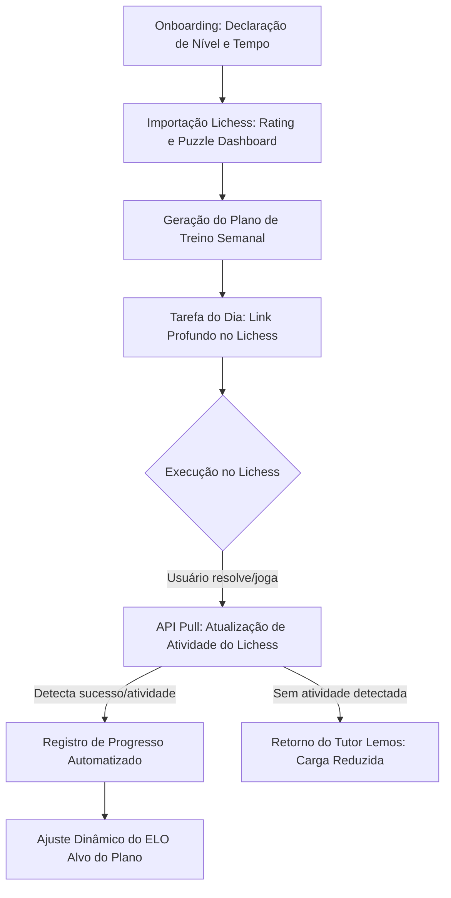

# Relatorio De Auditoria: Torre Aberta

- IA/autoria: Antigravity (Gemini 3.5 Flash)
- Nome proprio do relatorio: Relatorio Due Diligence Torre Aberta
- Data da analise: 2026-06-06
- Versao dos documentos analisados: Documentos locais na pasta do workspace `lichess-tutor`
- Sugestao de nome de arquivo: relatorio-antigravity-torre-aberta-lichess-tutor.md

---

## 1. Veredito Executivo

O projeto **Lichess Tutor** (aqui analisado sob o nome de trabalho e com sugestão de mudança de marca) apresenta uma excelente tese de oportunidade baseada em um modelo ético, 100% gratuito e focado na curadoria pedagógica. A premissa de que *"o aluno de xadrez não precisa de mais ferramentas, ele precisa de uma rotina simples"* é verdadeira e ataca a fadiga de decisão comum em estudantes auto-ditidatas.

No entanto, o plano atual sofre de **três ingenuidades críticas**:
1. **Risco de Marca (P0):** O nome "Lichess Tutor" viola diretamente as diretrizes de propriedade intelectual do Lichess.org, o que pode resultar no banimento imediato da API ou na suspensão do aplicativo.
2. **Fricção de Engajamento e Mecânica (P1):** A decisão de não ter tabuleiro próprio no MVP é acertada para velocidade de desenvolvimento, mas gera um fluxo de "mão dupla" confuso onde o usuário precisa ir ao Lichess, fazer a tarefa e voltar manualmente para dar check. Sem validação automatizada de progresso via API, o engajamento despencará em poucos dias.
3. **Complexidade de Sync vs. Política de Tokens (P1):** Sincronizar o estado do progresso entre múltiplos dispositivos (local-first com sync backend) enquanto se tenta evitar o armazenamento de tokens de longa duração (refresh tokens) cria uma experiência de usuário truncada, exigindo logins frequentes.

**Recomendação Final:** **CONSTRUIR COM ESCOPO REDUZIDO E PIVOT DE MARCA**. O projeto deve seguir em frente, mas com foco estrito na faixa de **0 a 1200 ELO** para o MVP, eliminação imediata de sync com backend no primeiro momento (lançando como um utilitário puramente offline/local-first) e alteração do nome público para evitar litígios de propriedade intelectual.

---

## 2. Nota Geral de Atratividade

**Nota: 7.5 / 10**

*   **Forças (Por que 7.5):** O app ataca um mercado em crescimento (xadrez online pós-boom de streamers e IA), aproveita uma infraestrutura fantástica e gratuita (API do Lichess) e adota um posicionamento de "antídoto ao cassino de dopamina dos apps modernos", focando em método e consistência.
*   **Limitações (Por que não 10):** A dependência de terceiros (Lichess e Chess.com) é de 100%. Qualquer mudança nas políticas de API ou limitação de taxa pode inviabilizar o produto. A monetização por doação externa pura dificulta a sustentabilidade de longo prazo caso o produto exija servidores parrudos (embora o modelo Cloudflare mitigue isso).

---

## 3. Tese de Oportunidade

O mercado de xadrez digital está saturado de plataformas de jogo (Lichess, Chess.com), de memorização de aberturas (Chessable) e de análise tática automatizada por computador (Aimchess, DecodeChess). Contudo, **existe um abismo entre ter acesso aos dados e saber o que fazer com eles**.

A tese de oportunidade do Lichess Tutor reside na **Curadoria de Fluxo de Trabalho (Workflow Curated Learning)**. Ele não tenta ser a sala de aula ou o tabuleiro; ele é a agenda e o professor que aponta a direção. Em vez de gastar recursos gerando tabuleiros complexos e engines locais pesados, o app se posiciona como um organizador de rotina leve, traduzindo o "caos de opções" do Lichess in uma única tarefa diária clara.

---

## 4. Principais Pontos Fortes

1.  **Custo de Infraestrutura Próximo a Zero:** O uso de PWAs locais (IndexedDB) combinado com Cloudflare Workers e D1 permite que o app atenda dezenas de milhares de usuários ativos no plano gratuito ou gastando menos de $5/mês.
2.  **Aproveitamento do Ecossistema Lichess:** Lichess possui um dos maiores bancos de dados abertos de xadrez do mundo. A plataforma fornece puzzles, exercícios teóricos, ferramentas de aprendizado e estudos de forma gratuita e pública. O Tutor atua apenas como um "pointer" inteligente para esses recursos.
3.  **Foco em Hábito sobre Gamificação Punitiva:** A pedagogia proposta ("ausência sem vergonha") se diferencia dos apps que usam streaks punitivos (estilo Duolingo), atraindo um público adulto que deseja estudar xadrez com seriedade e sem pressão psicológica artificial.
4.  **Licença Open-Source (AGPL-3.0):** Atrai a comunidade de desenvolvedores entusiastas de xadrez (altamente ativa no Reddit e GitHub), permitindo contribuições gratuitas no código e curadoria pedagógica.

---

## 5. Principais Pontos Fracos

1.  **Vulnerabilidade Externa Extrema:** Se o Lichess bloquear o acesso do app por suspeita de violação de marca ou abuso de taxa, o produto deixa de funcionar imediatamente.
2.  **Falta de Integração Fechada (Fricção):** Como os treinos ocorrem fora do app (em abas ou janelas do Lichess), o Tutor perde o controle sobre a experiência do usuário durante o treino. O aluno pode se distrair jogando partidas bullet rápidas ou simplesmente esquecer de registrar seu progresso no PWA.
3.  **Complexidade do Sync Local-First para Iniciantes:** Sincronizar logs de eventos em IndexedDB com um backend em SQLite (D1) sem exigir contas complexas pode gerar conflitos de dados difíceis de tratar em cenários de rede instável ou uso simultâneo de múltiplos dispositivos.
4.  **Limitação do Escopo 0-2000:** Tentar cobrir do iniciante absoluto (0 ELO) ao jogador avançado (2000 ELO) no MVP gera um motor de regras excessivamente complexo. As dores de um jogador de 1900 ELO (preparação de aberturas por estruturas, finais teóricos avançados) são radicalmente diferentes das de um de 700 ELO (não pendurar peças).

---

## 6. Riscos P0 / P1 / P2

Esta seção apresenta os riscos estratégicos mapeados na auditoria técnica e comercial.

| Risco | Impacto | Probabilidade | Severidade | Descrição do Problema | Mitigação Proposta | Esforço de Solução | Como Validar |
| :--- | :--- | :--- | :--- | :--- | :--- | :--- | :--- |
| **P0: Nome e Violação de Marca** | Crítico (Bloqueio total) | Altíssima | Crítica | O uso do termo "Lichess Tutor" no nome do produto e em caminhos de API viola as regras de marcas registradas e gera confusão de que o app é oficial. | Alterar o nome para algo independente (ex: *Lemos Chess Tutor*, *Tutor de Xadrez para Lichess*). Usar disclaimer claro e ostensivo no cabeçalho. | Mínimo | Solicitar feedback informal na comunidade oficial do Lichess antes do lançamento. |
| **P1: Loop de Fricção de Mão Dupla** | Alto (Abandono do usuário) | Alta | Alta | O usuário abre o app, clica no link, resolve a tarefa no Lichess, mas esquece de voltar ao PWA para marcar "concluído". | Usar a API do Lichess de background para puxar a atividade de puzzles e partidas do usuário. Se detectado progresso nas últimas 2 horas no Lichess, marcar a tarefa como resolvida automaticamente. | Médio (Integração de APIs de histórico) | Implementar testes de fluxo com usuários beta para ver se o registro automático reduz a taxa de abandono. |
| **P1: Expiração Constante de Sessão** | Médio (Frustração) | Alta | Média | Se não armazenarmos tokens de longa duração (refresh tokens) por privacidade, o usuário precisará fazer reautorização via OAuth constantemente para sincronizar dispositivos. | Armazenar o refresh token de forma segura (HttpOnly cookie no Worker, ou criptografado localmente no IndexedDB). Oferecer modo local sem sync por padrão. | Médio | Testar fluxo de uso contínuo de 7 dias com múltiplos acessos em mobile e desktop. |
| **P2: Limitação de Chamadas (429)** | Baixo (Lentidão) | Média | Média | O importador de partidas do Chess.com ou Lichess excede o limite de requisições se o usuário tiver muitas partidas ou se muitos usuários usarem o app concorrentemente. | Implementar cache rigoroso (24h) de estatísticas brutas locais. Limitar a importação apenas aos últimos 20 jogos no onboarding e ler apenas dados agregados pré-calculados. | Baixo | Simular concorrência local de chamadas em fila assíncrona com atraso mínimo de 1.5s entre requisições. |

---

## 7. Analise de Mercado, Concorrentes e Substitutos

### Matriz de Concorrência

| Produto | Preço/Modelo | Personalização | Usa Lichess | Usa Chess.com | Analisa Partidas | Cria Plano Diário | Tem Tutor/Coach | Mobile | Offline/PWA | Open-Source | Risco p/ Lichess Tutor | Diferencial de Oportunidade |
| :--- | :--- | :--- | :--- | :--- | :--- | :--- | :--- | :--- | :--- | :--- | :--- | :--- |
| **Aimchess** | Pago ($7.99/mês) | Alta (via dados) | Sim | Sim | Sim (Deep) | Sim | Sim (IA estática) | Sim | Não | Não | Altíssimo | Oferecer planos práticos baseados em recursos grátis do Lichess sem cobrar assinatura. |
| **Chessable** | Freemium | Média (Spaced Rep) | Não | Não | Não | Não | Não | Sim | Não | Não | Médio | Foco em hábitos gerais e táticas do dia a dia, e não em memorização exaustiva de linhas. |
| **Dr. Wolf** | Freemium ($5.99/mo) | Alta (Conversa) | Não | Não | Sim | Não | Sim (Voz/IA) | Sim (App) | Não | Não | Baixo | Tutor voltado a estudo externo (Lichess) em vez de partidas contra IA proprietária. |
| **Noctie** | Freemium ($13.90/mo) | Alta (Intuição) | Não | Não | Sim | Não | Sim (IA humana) | Sim (App) | Não | Não | Baixo | Direcionamento para comunidade focada em software livre e estudo gratuito. |
| **Lucas Chess** | Grátis (Open-source) | Baixa (Desktop) | Não | Não | Sim | Não | Não | Não (Desktop) | Não | Sim | Médio | Lucas Chess é focado em desktop offline e engines; o Tutor foca em mobile, PWA e Lichess. |
| **Lichess Interno**| 100% Grátis | Baixa (Filtros) | Sim | Não | Sim | Não | Não | Sim | Sim (PWA) | Sim | Altíssimo (Substituto)| Lichess fornece as ferramentas isoladas; o Tutor fornece a agenda e a curadoria pedagógica. |

### Análise de Substitutos e Diferenciação
O maior concorrente do Tutor não é o Chessable ou Aimchess, mas sim **a própria inércia do aluno no Lichess**. O Lichess já possui Puzzle Dashboard, Practice, Studies, Lichess Learn, etc.
**Por que o usuário usará o Tutor?**
Porque o Lichess é um "playground aberto". O aluno entra para fazer puzzles, se perde em ritmos de tempo inadequados (blitz/bullet), joga sem analisar e não foca em seus pontos fracos. O Tutor age como uma camada de **governança cognitiva**, impedindo que o aluno desperdice seu tempo de estudo.

---

## 8. Posicionamento de Produto

### Proposta de Posicionamento
*   **Em uma frase:** "O organizador de estudos gratuito que transforma o seu histórico no Lichess em um plano de treino diário personalizado."
*   **Em um parágrafo:** "Para jogadores de xadrez que se sentem perdidos ao tentar melhorar sozinhos, o app é um tutor digital que analisa suas fraquezas de jogo, cria uma rotina diária curta e abre as ferramentas exatas de treino no Lichess. Ao contrário de plataformas pagas e cheias de recursos gamificados que distraem você, nosso app é 100% gratuito, open-source e focado na consistência, ajudando você a evoluir no xadrez sem ansiedade."

### Landing Page Curta (Estrutura Proposta)
```html
<!-- Seção Hero -->
<h1>Estude xadrez com método. Sem pressa, sem custos.</h1>
<p>O tutor de xadrez open-source que cria sua rotina diária usando o Lichess. Conecte sua conta e receba suas tarefas personalizadas de hoje em menos de 1 minuto.</p>
<button>Entrar com Lichess</button>
<p class="disclaimer">App independente e não oficial do Lichess.org</p>

<!-- Seção de Proposta de Valor -->
<h2>Por que usar?</h2>
<ul>
  <li><strong>Rotina Inteligente:</strong> Chega de se perguntar o que estudar hoje. Nós analisamos seus erros e sugerimos a lição ideal.</li>
  <li><strong>100% Integrado:</strong> Seus exercícios e práticas abrem diretamente no Lichess.</li>
  <li><strong>Totalmente Grátis:</strong> Sem anúncios, sem paywalls, sem limite de puzzles diários. Nosso código é aberto para a comunidade.</li>
</ul>

<!-- Como Funciona -->
<h2>3 Passos para evoluir</h2>
<ol>
  <li><strong>Conecte seu perfil:</strong> Importamos de forma segura suas últimas estatísticas de rating e puzzles do Lichess e Chess.com.</li>
  <li><strong>Receba a lição do dia:</strong> Uma rotina de 15 a 45 minutos adaptada ao seu tempo e pontos fracos.</li>
  <li><strong>Pratique no Lichess:</strong> O Tutor abre o link correto. Terminou? Seu progresso é computado e o plano de amanhã é ajustado.</li>
</ol>
```

---

## 9. Analise Pedagogica e Metodo de Treino

O plano curricular de 0 a 2000 proposto no `docs/pedagogy/curriculum-0-2000.md` está pedagogicamente correto na teoria de xadrez clássica, mas apresenta **problemas severos de execução tecnológica no MVP**:
1.  **Limitação de Escopo Recomenda Travar em 0-1200:** Alunos acima de 1200 precisam de revisões de partidas com anotações profundas, estruturas de peões específicas e estudos avançados. O motor do app (regras locais na PWA) não tem capacidade analítica para interpretar isso sem uma infraestrutura complexa baseada em servidores com motores de xadrez (como Stockfish).
2.  **A Armadilha do Feedback Manual:** Se o aluno apenas marcar "feito", o Tutor não valida se ele aprendeu. O MVP deve rastrear dados da API de Puzzles do Lichess (completou o puzzle? acertou na primeira tentativa?).

### Metodologia Curricular Recomendada para o MVP (Foco Estrito: 0-1200 ELO)



#### Níveis Detalhados no MVP:
*   **Faixa 0-800 ELO (Iniciante):**
    *   *Foco Pedagógico:* Eliminar peças penduradas, mate em 1 lance e habituar a olhar as ameaças do adversário.
    *   *Mecânica do App:* Abre URLs de `lichess.org/learn` e puzzles com tag `#mate1` ou `#hangingPiece`.
*   **Faixa 800-1200 ELO (Intermediário Inicial):**
    *   *Foco Pedagógico:* Táticas básicas de bifurcação (garfo), cravada, espeto, mate em 2 lances e noções de finais básicos (Rei + Peão).
    *   *Mecânica do App:* Links para `lichess.org/practice` (finais) e puzzles selecionados por tema tático deficitário (obtidos pela API de atividade de Puzzles).

---

## 10. Arquitetura Tecnica Revisada

A stack baseada em **React + Vite + Cloudflare Workers + D1** é excelente para escalabilidade de baixo custo. No entanto, para simplificar e garantir a máxima privacidade e segurança dos dados dos usuários, propomos uma **Arquitetura em Duas Etapas**:

### Fase 1 (MVP Local-First Puro - Sem Sync Server)
Para acelerar o lançamento e validar a hipótese sem criar custos ou armazenar PII em nuvem, o app deve funcionar puramente no cliente:
*   **IndexedDB (com localforage/Dexie.js):** Armazena todas as notas, progresso, plano semanal e histórico local.
*   **Lichess OAuth PKCE:** Ocorre inteiramente no frontend (Implicit Flow ou Auth Code sem Client Secret). O token de acesso do Lichess é guardado apenas na memória do cliente (`sessionStorage` ou `localStorage`) e usado para requisições diretas de API cliente-Lichess.
*   **Sem Backend Cloudflare:** Zero banco de dados centralizado. Zero riscos de vazamento de dados de sessão.

### Fase 2 (Sync Opcional com Cloudflare Workers + D1)
Quando a comunidade pedir sincronização entre múltiplos dispositivos:

```
[ Navegador / PWA ] <--- OAuth PKCE ---> [ Lichess API ]
        |
   (SyncEvent)
        v
[ CF Worker API Proxy ] (Autentica via JWT gerado no login)
        |
        v
[ Cloudflare D1 ] (SQLite) -> Tabela de Eventos (Push/Pull)
```

#### Modelo de Dados Mínimo para D1 (Sync de Eventos):
```sql
CREATE TABLE users (
    id TEXT PRIMARY KEY, -- Hash SHA-256 do ID do usuário no Lichess
    created_at DATETIME DEFAULT CURRENT_TIMESTAMP
);

CREATE TABLE sync_events (
    id TEXT PRIMARY KEY,
    user_id TEXT,
    client_id TEXT,
    event_type TEXT,
    payload TEXT, -- JSON com dados derivados (ex: targetBand, weeklyMinutes)
    created_at DATETIME,
    seq INTEGER PRIMARY KEY AUTOINCREMENT,
    FOREIGN KEY(user_id) REFERENCES users(id)
);
```

#### Política de Armazenamento e Tokens:
*   **Tokens Lichess:** Nunca devem ser salvos na tabela `sync_events` ou no banco D1. Se o sync precisar de autenticação, o CF Worker deve apenas validar o token com o endpoint `GET lichess.org/api/account` e, em caso de sucesso, emitir um token JWT de sessão curto (por exemplo, 2 horas) para o cliente realizar o push/pull de eventos. Isso elimina a necessidade de persistir tokens de longa duração no servidor.

---

## 11. Analise de Custos e Sustentabilidade

Abaixo está o modelo de custos projetado com base nas cotas atuais da Cloudflare (2026):

| Escala de Usuários | Requisições Sync / Dia | Custo Estimado Cloudflare Workers + D1 | Gargalo Operacional | Sustentabilidade Proposta |
| :--- | :--- | :--- | :--- | :--- |
| **100** | ~500 | $0.00 (Totalmente no Free Tier) | Nenhum. | Doação não é necessária para cobrir infraestrutura. |
| **1.000** | ~5.000 | $0.00 (Totalmente no Free Tier) | Suporte a bugs locais e compatibilidade de navegadores. | Doações espontâneas via Ko-fi ou Apoia.se cobrem custos de domínio. |
| **10.000** | ~50.000 | $0.00 (Ainda dentro do limite de 100k requests/dia de Workers) | Limites de conexões simultâneas e escrita de banco de dados SQLite. | Necessário configurar domínio profissional. Campanha de financiamento coletivo sem recompensas. |
| **100.000** | ~500.000 | ~$5.00/mês (Workers Paid Plan: 10M requests inclusos) | D1 excedendo 5GB de storage gratuito (excedente de $0.75/GB). | Ponto de equilíbrio atingido com 5 a 10 doadores recorrentes de $1. B2C voluntário. |

### Medidas de Sustentabilidade Econômica:
1.  **Limitação de Escrita:** O sync só deve rodar quando o usuário fechar o app, completar uma tarefa ou a cada 15 minutos de uso ativo. Isso reduz as requisições escritas no D1.
2.  **Compressão de Dados:** O payload do evento de sincronização deve ser severamente limitado a dados numéricos e strings curtas. Notas e observações longas do aluno devem ter limite de caracteres (ex: 500 caracteres).
3.  **Hospedagem Estática Gratuita:** Hospedar a PWA na Cloudflare Pages ou GitHub Pages (custo zero).

---

## 12. Privacidade, Seguranca e Compliance

Para se manter alinhado à LGPD/GDPR sem a complexidade burocrática de gerenciar dados pessoais sensíveis, o app deve seguir o princípio da **privacidade por padrão (Privacy by Design)**.

### Tabela de Dados e Mitigações

| Tipo de Dado | Onde é Salvo | Finalidade | Tempo de Retenção | Risco Associado | Mitigação |
| :--- | :--- | :--- | :--- | :--- | :--- |
| **Username Lichess** | IndexedDB & D1 | Identificação do perfil para importação de dados públicos. | Até a exclusão da conta. | Associação de desempenho de xadrez com identidade real do usuário. | Tratar o username como identificador público secundário. Não coletar nome real ou e-mail. |
| **Dados de Desempenho (Ratings, Temas de Puzzles)** | IndexedDB (Local) e D1 (Sincronizado) | Geração personalizada das lições. | Histórico de 3 meses (depois compactado em médias mensais). | Exposição de dados de estudo. | Não coletar PGNs completos de jogos, apenas estatísticas agregadas (Ex: "Taxa de erro em garfo de cavalo: 40%"). |
| **Token Lichess Access Token** | Apenas IndexedDB/SessionStorage | Efetuar chamadas seguras à API de puzzles. | Até expiração natural (horas/dias). | Roubo do token e personificação do usuário no Lichess. | Não enviar o token para o banco de dados centralizado em hipótese alguma. |

### Texto Preliminar de Política de Privacidade (Linguagem Simples)
> **Nossa Política de Privacidade é Direta: Nós Não Queremos Seus Dados.**
> 
> 1. **O que coletamos:** Apenas o seu nome de usuário do Lichess (e opcionalmente do Chess.com) e suas estatísticas públicas de jogo e puzzles. Nós não coletamos seu e-mail, seu nome real ou sua senha.
> 2. **Como usamos:** Usamos esses dados de jogo para criar o seu plano de treino diário personalizado. O app é executado no seu navegador e armazena os dados no seu próprio dispositivo.
> 3. **Serviços de Terceiros:** Suas tarefas de xadrez são abertas diretamente no site oficial do Lichess.org. Sujeito às regras e termos de privacidade deles.
> 4. **Exclusão de Dados:** Você pode apagar todos os seus dados locais limpando o cache do navegador e usar a opção "Excluir Conta" nas configurações do app para remover quaisquer dados de sincronização do nosso servidor instantaneamente.

---

## 13. Metodos de Administracao e Operacao

Para um projeto open-source sem fins lucrativos e mantido inicialmente por um único desenvolvedor/pequeno grupo, recomendamos o método **Shape Up adaptado** combinado com **ADRs (Architecture Decision Records)**:

1.  **Ciclos de 4 Semanas (Shape Up Light):**
    *   2 weeks de definição e design detalhado da funcionalidade (Pitch).
    *   2 weeks de codificação limpa e focada (Build).
    *   1 week de teste de integração (Cool-down) antes da release pública.
2.  **Uso Rígido de ADRs:**
    *   Toda mudança de infraestrutura, sincronização ou comportamento pedagógico central deve ser precedida por um arquivo markdown de decisão na pasta `docs/adr/` (seguindo o padrão já iniciado com ADR-001/002/003).
3.  **Definition of Done (DoD) para Contribuições Open-Source:**
    *   Zero warnings no build do TypeScript estrito.
    *   Comportamento responsivo validado em telas mobile (360px de largura mínima).
    *   Não-regressão nas regras locais de geração de planos (testado via testes unitários locais com mocks de dados Lichess).

---

## 14. Propostas Alternativas de Produto

Abaixo estão analisados cinco caminhos alternativos de implementação para avaliar o custo de oportunidade:

### 1. PWA com Sync Central (Planejado no MVP)
*   *Vantagens:* Sincronização automática entre mobile e desktop.
*   *Desvantagens:* Exige banco de dados na nuvem, tratamento de autenticação segura e gerenciamento de conflitos de sincronização.
*   *Custo:* Médio.
*   *Recomendação:* **Adiar para a Fase 2.**

### 2. PWA Local-First Puro (Sem Backend Inicial)
*   *Vantagens:* Lançamento ultrarrápido, zero custo de servidor, zero responsabilidade legal por vazamento de dados, 100% de privacidade.
*   *Desvantagens:* Se o usuário trocar do computador para o celular, o plano diário recomeça do zero e o progresso local não se transfere automaticamente (a menos que ele faça export/import manual via arquivo JSON).
*   *Custo:* Praticamente zero esforço de backend.
*   *Recomendação:* **Recomendado para o MVP inicial (Fase 1).**

### 3. Extensão de Navegador (Browser Companion)
*   *Vantagens:* Pode rodar diretamente no site do Lichess, detectando de forma automática e imediata quando o usuário conclui um puzzle ou partida sem precisar que ele volte para o PWA.
*   *Desvantagens:* Não funciona no aplicativo nativo de celular ou navegadores mobile comuns (Safari iOS, Chrome Android padrão não aceitam extensões facilmente).
*   *Custo:* Alto (duplicar lógica ou limitar a usuários desktop).
*   *Recomendação:* **Rejeitar.**

### 4. Assistente sem Login (Baseado apenas em Nome de Usuário)
*   *Vantagens:* O usuário entra no app, digita seu username (Lichess/Chess.com) e o plano de treino é montado imediatamente lendo dados da API pública. Sem burocracia de OAuth.
*   *Desvantagens:* Não é possível ler dados privados (como Puzzle Dashboard detalhado ou notas pessoais do aluno) e qualquer pessoa pode ver o progresso de qualquer jogador (falta de privacidade).
*   *Custo:* Muito baixo.
*   *Recomendação:* **Usar como fluxo de demonstração (Demo Mode) antes do login OAuth real.**

### 5. Bot de Planejamento no Discord / Telegram
*   *Vantagens:* Sem desenvolvimento de interface web/PWA complexa. O bot envia a tarefa diária por mensagem direta para o aluno e recebe comandos de texto simples.
*   *Desvantagens:* Não tem apelo visual premium, perda de controle sobre o fluxo pedagógico, difícil de escalar internacionalmente.
*   *Custo:* Baixo.
*   *Recomendação:* **Rejeitar.**

---

## 15. Experimentos de Validacao (Sem Codificar)

Antes de iniciar qualquer código ou infraestrutura técnica de aplicativo, propomos realizar os seguintes experimentos manuais de validação de hipóteses de mercado:

### Experimento 1: A Landing Page Seca (Validação de Interesse)
*   **Pergunta a responder:** Existe interesse real dos enxadristas em um "tutor de estudos integrado ao Lichess"?
*   **Como executar:** Criar uma landing page estática simples (usando GitHub Pages ou Carrd) explicando o conceito do produto com mockups visuais criados por IA e um botão de ação proeminente: "Entrar com Lichess (Lista de Espera Beta)".
*   **Amostra Mínima:** 500 acessos únicos gerados organicamente em comunidades do Reddit (r/chess, r/lichess).
*   **Sinal de Sucesso:** Taxa de conversão de cliques na lista de espera acima de 15%.
*   **Sinal de Fracasso:** Conversão abaixo de 5%.
*   **Decisão pós-resultado:** Se falhar, a tese de produto precisa de pivotagem no posicionamento ou na dor atacada.

### Experimento 2: O Tutor Humano-Mágico (Validação Pedagógica e de Valor)
*   **Pergunta a responder:** Uma rotina semanal de xadrez baseada em links de tarefas do Lichess realmente gera consistência e satisfação no aluno?
*   **Como executar:** Recrutar 10 alunos voluntários (ELO Lichess entre 600 e 1200). Semanalmente, um "tutor humano" atua simulando o algoritmo: analisa o histórico do jogador manualmente no Lichess, monta uma planilha com as tarefas do dia a dia (links profundos do Lichess) e envia por WhatsApp/Telegram com as mensagens no tom do "Professor Lemos".
*   **Tempo:** 2 semanas.
*   **Sinal de Sucesso:** Mais de 70% das tarefas concluídas pelos alunos e feedbacks de que "se sentiram guiados e organizados".
*   **Sinal de Fracasso:** Os alunos abandonam a planilha nos primeiros 4 dias ou dizem que preferem fazer exercícios soltos.
*   **Decisão pós-resultado:** Ajustar a duração das lições diárias ou o tom de escrita do Professor Lemos.

---

## 16. Recomendacao Final e Roadmap de Execucao

### Roadmap Recomendado em 4 Fases

```
[ FASE 0: Validação Estática ] -> [ FASE 1: MVP Local-First ] -> [ FASE 2: Sync Server CF ] -> [ FASE 3: Lançamento Global ]
(Landing Page + Teste Piloto)     (React + IndexedDB + OAuth)     (Workers + D1 + Sync Opcional) (Internacionalização/Suporte)
```

#### Fase 0: Validação de Dor (2 Semanas)
*   **Objetivo:** Validar tese e interesse dos usuários.
*   **Atividades:**
    1. Publicação da Landing Page de demonstração.
    2. Recrutamento e teste piloto manual de 2 semanas com 10 voluntários (Experimento 2).
*   **Critério de Entrada na Próxima Fase:** Lista de esperac om pelo menos 150 contatos ou taxa de engajamento do piloto manual superior a 70%.

#### Fase 1: MVP Local-First Puro (4 Semanas)
*   **Objetivo:** Lançar uma versão funcional estável para uso local.
*   **Funcionalidades:**
    *   Login via Lichess OAuth PKCE (salvo estritamente no cliente).
    *   Onboarding inicial rápido e importação estática do Chess.com (via username pública).
    *   Motor local de regras em TypeScript para montagem do plano diário.
    *   Tela "Hoje" com links profundos para o Lichess.
    *   Exclusão total de dados com 1 clique (limpeza do IndexedDB).
*   **Não-Escopo:** Banco Cloudflare D1, sync automático, mensagens do tutor personalizadas por LLM, suporte a múltiplos idiomas (foco apenas em PT-BR).

#### Fase 2: Sincronização Opcional (3 Semanas)
*   **Objetivo:** Permitir uso contínuo em desktop e celular.
*   **Funcionalidades:**
    *   Criação da API de sync em Cloudflare Workers + D1 usando fluxo de eventos (`push`/`pull`).
    *   Autenticação da API temporária via validação do token do Lichess (sem guardar tokens no banco D1).
    *   Mecanismo de resolução de conflitos de sync baseado em `updatedAt`.

#### Fase 3: Expansão e Ajustes Pedagógicos (A partir de feedback)
*   **Objetivo:** Estender o suporte pedagógico e internacionalização.
*   **Funcionalidades:**
    *   Internacionalização (Inglês como idioma padrão configurável).
    *   Ajuste do algoritmo com base em feedbacks reais dos usuários de 0-1200.
    *   Melhoria no rastreamento automatizado de completitude de puzzles e partidas.

---

## 17. Perguntas Abertas para Alinhamento Estratégico

Para fechar esta due diligence, o time de desenvolvimento deve alinhar com os stakeholders as seguintes questões estratégicas:

1.  **Mudança de Marca:** Estamos dispostos a mudar o nome do produto de "Lichess Tutor" para algo como **"Tutor de Estudo Lemos (para Lichess)"** ou **"Augusto Chess Coach"** para blindar juridicamente o projeto contra processos de marca?
2.  **Rastreamento Automático vs. Manual:** Devemos investir esforço técnico no MVP para verificar se o puzzle foi resolvido (via consulta periódica à API do Lichess) ou a marcação puramente manual do aluno ("Marcar como Feito") é suficiente para a primeira versão?
3.  **Pilha Local Pura de Lançamento:** Aprovamos o início do desenvolvimento focando 100% no modelo Local-First (sem backend de sync inicial) para mitigar riscos de vazamento de dados, acelerar o time-to-market e manter o custo de servidores em zero absoluto?
