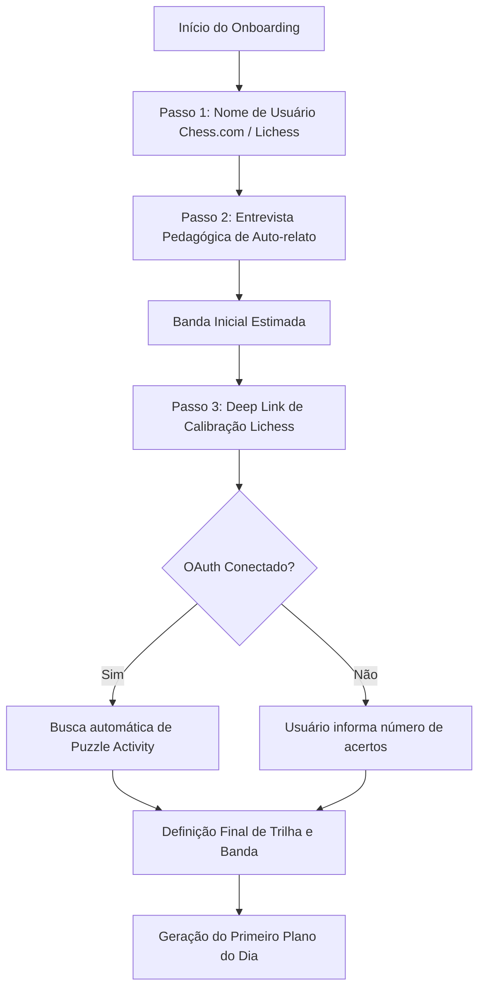

# Relatório Gemini — Contestação da Análise Geral (2026-06-10)

Autor: Gemini (Consultor Crítico)
Papel nesta rodada: Contestação rigorosa do [Relatório Claude — Análise Geral Profunda do Projeto (2026-06-10)](file:///c:/Users/tavar/OneDrive/Documentos/CLAUDE%20CODE/APRENDER%20XADREZ/lichess-tutor/docs/review/relatorio-claude-analise-geral-2026-06-10.md).

---

## 1. Veredito Geral

**Nota: 7.0/10**

1. O relatório do Claude demonstra solidez técnica ao identificar com precisão o risco crítico de volatilidade de dados do IndexedDB (R-1) e as lacunas lógicas funcionais em relação à visão ampliada do dono.
2. No entanto, comete um erro de verificação factual ao alegar que o spec do método reside apenas no "archive" e demonstra desconhecimento de psicologia educacional aplicada ao TDAH ao empurrar a gamificação (recompensas) e o onboarding (placement) para o fim da priorização de desenvolvimento.
3. O plano de cortes de Claude é excessivamente centrado em engenharia e subestima o valor do onboarding imediato e dos micro-incentivos de consistência como fatores críticos de retenção na fase inicial do app pessoal.

---

## 2. Tabela de Achados e Contestação

Abaixo, avalio individualmente cada achado do relatório do Claude (erros A-1..A-6, contradições C-1..C-6, risco R-1 e gaps G-1..G-11) confrontando-os com as fontes do repositório.

| ID | Achado do Claude | Veredito Gemini | Argumentação e Fontes do Repositório |
|---|---|---|---|
| **A-1** | README.md afirmava "não contém app" | **CONCORDO** | Fato real. O README.md estava desatualizado em relação às fases concluídas P0-P3, descritas em [state.md:L9-L12](file:///c:/Users/tavar/OneDrive/Documentos/CLAUDE%20CODE/APRENDER%20XADREZ/lichess-tutor/memory/state.md#L9-L12). |
| **A-2** | memory/state.md dizia "iniciada" | **CONCORDO** | Fato real. O status constava como em andamento, embora as 9 tarefas tivessem sido integradas com sucesso em commits anteriores, conforme documentado em [state.md:L83-L87](file:///c:/Users/tavar/OneDrive/Documentos/CLAUDE%20CODE/APRENDER%20XADREZ/lichess-tutor/memory/state.md#L83-L87). |
| **A-3** | AGENTS.md aponta spec obsoleto e spec do método vive em archive | **DISCORDO** | **ERRO FACTUAL DE CLAUDE**. O spec pedagógico do método não vive em archive; ele está documentado em [metodo-professor-lemos.md](file:///c:/Users/tavar/OneDrive/Documentos/CLAUDE%20CODE/APRENDER%20XADREZ/lichess-tutor/docs/pedagogy/metodo-professor-lemos.md) e [metodo-consolidado-acervo-2026-06-09.md](file:///c:/Users/tavar/OneDrive/Documentos/CLAUDE%20CODE/APRENDER%20XADREZ/lichess-tutor/docs/pedagogy/metodo-consolidado-acervo-2026-06-09.md). A especificação de design correspondente ao tutor está ativa em [2026-06-08-professor-lemos-tutor-design.md](file:///c:/Users/tavar/OneDrive/Documentos/CLAUDE%20CODE/APRENDER%20XADREZ/lichess-tutor/docs/superpowers/specs/2026-06-08-professor-lemos-tutor-design.md). Apenas prompts operacionais do Codex foram arquivados em `prompts/archive/2026-06-method/`. |
| **A-4** | ADR-006 filename diz "sem-oauth", conteúdo diz "com oauth" | **CONCORDO** | Fato real. O nome do arquivo [ADR-006-adaptativo-sem-oauth-sem-engine.md](file:///c:/Users/tavar/OneDrive/Documentos/CLAUDE%20CODE/APRENDER%20XADREZ/lichess-tutor/docs/adr/ADR-006-adaptativo-sem-oauth-sem-engine.md) está incompatível com a decisão descrita em seu próprio título (linha 1: "Com OAuth Opt-in Mínimo"). |
| **A-5** | decisions.md numeração duplicada | **CONCORDO** | Fato real. Resolvido na limpeza de 2026-06-10 em [decisions.md:L411-L413](file:///c:/Users/tavar/OneDrive/Documentos/CLAUDE%20CODE/APRENDER%20XADREZ/lichess-tutor/memory/decisions.md#L411-L413). |
| **A-6** | LICENSE ausente | **CONCORDO** | Fato real. Não existe arquivo LICENSE no repositório, apesar de a licença ser planejada em [PLANO.md:L63](file:///c:/Users/tavar/OneDrive/Documentos/CLAUDE%20CODE/APRENDER%20XADREZ/lichess-tutor/PLANO.md#L63). |
| **C-1** | Quatro tetos de curso diferentes | **CONCORDO** | Fato real. A decisão do dono em 2026-06-10 em [decisions.md:L385-L386](file:///c:/Users/tavar/OneDrive/Documentos/CLAUDE%20CODE/APRENDER%20XADREZ/lichess-tutor/memory/decisions.md#L385-L386) unificou o teto em `0-2200` + "faixa 2200+: autonomia". |
| **C-2** | "30 mil horas" desequilibrado | **CONCORDO** | Fato real. Corrigido pelo dono para marcos elásticos (100h / 500h / 1.000h+) em [decisions.md:L387-L389](file:///c:/Users/tavar/OneDrive/Documentos/CLAUDE%20CODE/APRENDER%20XADREZ/lichess-tutor/memory/decisions.md#L387-L389). |
| **C-3** | Badges vs gamificação vazia | **CONCORDO** | Fato real. O alinhamento foi fechado pelo dono em [decisions.md:L390-L392](file:///c:/Users/tavar/OneDrive/Documentos/CLAUDE%20CODE/APRENDER%20XADREZ/lichess-tutor/memory/decisions.md#L390-L392), restringindo a badges de esforço e processo sem streaks punitivos. |
| **C-4** | Visão colaborativa vs P4/P5 congelados | **INCOMPLETO** | O relatório peca por não propor critérios objetivos de descongelamento baseados em dados reais de uso pessoal. O AGENTS.md permanece rígido sem prever essa transição. |
| **C-5** | Tom adulto vs iniciante/jovem | **INCOMPLETO** | Claude não especifica como harmonizar. Proponho a fórmula de acessibilidade cognitiva descrita abaixo (Linguagem Simples ≠ Infantil). |
| **C-6** | Rating vs Metas de esforço | **CONCORDO** | Fato real. As faixas de rating organizam o currículo (conteúdo), enquanto as horas e tarefas organizam os objetivos do aluno na UI. |
| **R-1** | IndexedDB volátil | **CONCORDO** | Risco real e grave. O IndexedDB pode sofrer eviction ("best-effort storage"), destruindo o progresso do usuário. Exige mitigação prioritária conforme [decisions.md:L393-L396](file:///c:/Users/tavar/OneDrive/Documentos/CLAUDE%20CODE/APRENDER%20XADREZ/lichess-tutor/memory/decisions.md#L393-L396). |
| **G-1** | Currículo denso 1200-2200 | **CONCORDO** | Fato real. A lacuna existe e deve ser resolvida sequencialmente. |
| **G-2** | Placement (questionário + histórico) | **INCOMPLETO** | Claude aponta a lacuna, mas não propõe a arquitetura de onboarding "clean-room" (sem tabuleiro e sem OAuth invasivo). |
| **G-3** | Botão "importar atividade livre" | **CONCORDO** | Funcionalidade muito útil que alavanca as APIs oficiais do Lichess (`puzzle:read`). |
| **G-4** | Relatório pós-sessão e projeção | **CONCORDO** | Baixo custo técnico e alto impacto pedagógico. Apenas expõe os dados de logs em narrativa. |
| **G-5** | Painel amplo de progresso | **INCOMPLETO** | Claude não descreveu como construir o mapa de habilidades usando unicamente as tabelas do IndexedDB existentes em [db.ts:L46-L58](file:///c:/Users/tavar/OneDrive/Documentos/CLAUDE%20CODE/APRENDER%20XADREZ/lichess-tutor/src/infra/storage/db.ts#L46-L58). |
| **G-6** | Badges e conquistas | **DISCORDO DA PRIORIDADE** | **PONTO CEGO DE CLAUDE**. Rebaixar badges para o Corte 5 desconsidera as necessidades de engajamento de um aluno com TDAH. Devem ser antecipadas para o início da fase de uso real. |
| **G-7** | Metas semanais/mensais | **CONCORDO** | Simples agregação matemática sobre logs de tempo e sessoes concluidas. |
| **G-8** | Pesquisa pedagógica contínua | **CONCORDO** | Já está funcionando informalmente e deve ser mantida. |
| **G-9** | UX parecida com Lichess/Chess.com | **CONCORDO** | O design tokens devem inspirar familiaridade sem violar a regra clean-room de direitos autorais de [AGENTS.md:L21-L24](file:///c:/Users/tavar/OneDrive/Documentos/CLAUDE%20CODE/APRENDER%20XADREZ/lichess-tutor/AGENTS.md#L21-L24). |
| **G-10**| Plataforma colaborativa open-source | **CONCORDO** | Deve ser mantida em P5 (congelada). |
| **G-11**| Sync multi-dispositivo | **CONCORDO** | Grande lacuna, a ser mitigada em curto prazo por export locais antes de descongelar a P4. |

---

## 3. Os 5 Pontos Mais Fracos do Relatório do Claude

1. **Falso Testemunho sobre a Localização das Specs (Achado A-3):** Claude afirmou que a especificação do método vivia na pasta de archive, ignorando o arquivo canônico [metodo-professor-lemos.md](file:///c:/Users/tavar/OneDrive/Documentos/CLAUDE%20CODE/APRENDER%20XADREZ/lichess-tutor/docs/pedagogy/metodo-professor-lemos.md) e o spec ativo [2026-06-08-professor-lemos-tutor-design.md](file:///c:/Users/tavar/OneDrive/Documentos/CLAUDE%20CODE/APRENDER%20XADREZ/lichess-tutor/docs/superpowers/specs/2026-06-08-professor-lemos-tutor-design.md).
2. **Subestimação do Fator Dopaminérgico do TDAH:** O plano de cortes proposto empurra a gamificação baseada em esforço (badges) e o onboarding interativo para os últimos estágios (Corte 5 e 6). Para um estudante com TDAH, a falta de micro-incentivos iniciais e o posicionamento incorreto do nível levam ao abandono precoce do produto.
3. **Omissão do Desenho Concreto de Placement (G-2):** Claude apontou a falta de onboarding, mas não desenhou o fluxo para posicionar o aluno sem tabuleiro nativo e sem expandir escopos de OAuth (o que violaria [AGENTS.md:L30](file:///c:/Users/tavar/OneDrive/Documentos/CLAUDE%20CODE/APRENDER%20XADREZ/lichess-tutor/AGENTS.md#L30)).
4. **Omissão de Arquitetura de Progresso (G-5):** O relatório aponta que falta o painel de progresso, mas não detalha como cruzar os dados de logs (`TrainingLog`), fraquezas (`Weakness`) e sinais de puzzle (`themeStats`) já armazenados no IndexedDB.
5. **Indefinição da Arquitetura do Sync Aditivo (P4):** Claude não especificou nenhuma orientação arquitetônica preventiva para o schema atual do Dexie (como chaves de merge ou soft deletes), o que acarretará em reescrita massiva de código no futuro.

---

## 4. Aprofundamento UX, Recompensas, Progresso e Placement

### 4.1 UX e Gamificação Saudável para TDAH

Estudos sobre gamificação em contextos com TDAH (ex.: *Przybylski et al., 2010* sobre a Teoria de Autodeterminação) apontam que recompensas extrínsecas que estimulam comparação social ou punem a ausência (como streaks tradicionais de Duolingo) geram ansiedade e provocam o "efeito *what-the-hell*" (o abandono total após a primeira falha). 

Propõe-se o desenho de um **Painel de Conquistas de Esforço** com 5 medalhas não-punitivas:

1. **Constância Sóbria (Esforço):** Concedido ao concluir 3 sessões em 3 dias quaisquer na mesma semana. Não é zerado se o usuário falhar em dias consecutivos; ele apenas reinicia a contagem no próximo ciclo semanal.
2. **Retorno de Ouro (Resiliência TDAH):** Concedido quando o usuário abre o app e completa um treino após um intervalo de 2 ou mais dias sem uso. Isso transforma a culpa em reforço positivo direto (ligado ao parâmetro `Consistency.returnedAfterGap === true` definido em [types.ts:L88](file:///c:/Users/tavar/OneDrive/Documentos/CLAUDE%20CODE/APRENDER%20XADREZ/lichess-tutor/src/domain/types.ts#L88)).
3. **Foco Inabalável (Processo):** Concluir um bloco planejado de 30 minutos sem usar a ação "Pular".
4. **Limpeza de Gaveta (Revisão):** Resolver ativamente 5 pendências da fila de revisão (tabela `pendingItems`, ligada ao drill de Tratamento de Pendências).
5. **Explorador Lichess (Integração):** Conectar o OAuth PKCE e importar com sucesso a primeira atividade de puzzles.

#### Tradução Visual Clean-Room (UX Familiar)
* **Design Geral:** Usar CSS puro para recriar as cores HSL escuras refinadas de Lichess e Chess.com (grafite escuro `#161512` do Lichess para fundo de tela; azul-sutil do Chess.com `#262421` para cards).
* **Tipografia:** Importar e utilizar a fonte *Outfit* ou *Inter* do Google Fonts para manter o tom adulto e afastar qualquer infantilização.
* **Micro-animações:** Transição CSS suave (`transition: all 0.2s ease`) ao passar o mouse ou tocar em botões. Ao desbloquear um badge, exibir uma animação de escala e brilho suave (`keyframes` de pulso de luz) em vez de popups intrusivos.

### 4.2 Painel de Progresso (G-5) — Estrutura e Dados Reais

O "Mapa de Habilidades" sugerido será alimentado unicamente pelos dados já persistidos no IndexedDB, sem adição de novos campos no schema de [db.ts:L46-L58](file:///c:/Users/tavar/OneDrive/Documentos/CLAUDE%20CODE/APRENDER%20XADREZ/lichess-tutor/src/infra/storage/db.ts#L46-L58):

```
+-------------------------------------------------------------+
|                     MAPA DE HABILIDADES                     |
|                                                             |
|  [Habilidade]                [Nível Atual / Taxa de Acerto] |
|                                                             |
|  Hanging Pieces  (DAMP-D)    [██████████████░░░░░] 73%      |
|  Forks & Tactics (DAMP-A)    [████████░░░░░░░░░░░] 42% (Fraca)|
|  Pawn Endgames               [███████████████████] 100% (Ok)|
|                                                             |
|  * Diplomas Conquistados: [Peão: OK] [Torre: --] [Rei: --]  |
|  * Tempo Total de Prática Deliberada: 14.5 horas            |
+-------------------------------------------------------------+
```

* **Métrica de Domínio Tático:** Agregação dos dados da tabela `logs`. Filtra-se por `TrainingLog.result`. Caso contenha `themeStats` (que possui `attempts` e `losses`, conforme definido em [types.ts:L261-L267](file:///c:/Users/tavar/OneDrive/Documentos/CLAUDE%20CODE/APRENDER%20XADREZ/lichess-tutor/src/domain/types.ts#L261-L267)), calcula-se:
  $$\text{Taxa de Acerto} = \frac{\sum(\text{attempts} - \text{losses})}{\sum\text{attempts}}$$
* **Indicador de Força:** Classificar as habilidades como **Fraca** (acerto < 60%), **Estável** (60% a 80%) e **Dominada** (> 80%).
* **Esforço Acumulado:** Soma de `elapsedSeconds` agrupados pelo `methodTrackId` de cada bloco concluído (`PlanBlock.methodTrackId` em [types.ts:L142](file:///c:/Users/tavar/OneDrive/Documentos/CLAUDE%20CODE/APRENDER%20XADREZ/lichess-tutor/src/domain/types.ts#L142)).
* **Diplomas:** Leitura da tabela `diplomaAttempts` onde `passed === true` ([types.ts:L82](file:///c:/Users/tavar/OneDrive/Documentos/CLAUDE%20CODE/APRENDER%20XADREZ/lichess-tutor/src/infra/storage/db.ts#L82) e [method/types.ts:L50](file:///c:/Users/tavar/OneDrive/Documentos/CLAUDE%20CODE/APRENDER%20XADREZ/lichess-tutor/src/domain/method/types.ts#L50)).

### 4.3 Fluxo de Onboarding e Placement (G-2)

Como realizar a calibração de entrada sem tabuleiro interno e sem novas permissões OAuth:



1. **Passo 1 (Histórico):** O usuário digita seus usernames. O app busca o histórico público via API pública. Se rating rapid do Chess.com for >1200, define baseline como `800-1200` (ou idealmente `1000-1200`). Se <800, define baseline como `0-600` (conforme [metodo-consolidado-acervo-2026-06-09.md:L58-L60](file:///c:/Users/tavar/OneDrive/Documentos/CLAUDE%20CODE/APRENDER%20XADREZ/lichess-tutor/docs/pedagogy/metodo-consolidado-acervo-2026-06-09.md#L58-L60)).
2. **Passo 2 (Entrevista):** Exibição de 4 perguntas simples (ex.: *"Qual a sua maior dificuldade?"* com opções como *"Penduro peças no início"* ou *"Não sei finais"*).
3. **Passo 3 (Calibração Tática Externa):** 
   * Se o usuário foi estimado na faixa `800-1200`, o app gera um link direto para [https://lichess.org/training/fork](https://lichess.org/training/fork). Se estiver na faixa `0-600`, gera um link para [https://lichess.org/training/hangingPiece](https://lichess.org/training/hangingPiece).
   * O usuário resolve 3 puzzles no Lichess.
   * Se o OAuth estiver conectado, o app lê as últimas 3 tentativas usando o escopo `puzzle:read` em [appData.ts:L120](file:///c:/Users/tavar/OneDrive/Documentos/CLAUDE%20CODE/APRENDER%20XADREZ/lichess-tutor/src/infra/storage/appData.ts#L120). Se não estiver, o usuário seleciona quantos puzzles acertou (0, 1, 2 ou 3) em um formulário interativo de retorno.
   * *Ajuste de Trilha:* 3 acertos → Inicializa na trilha `calculation-bridge` / `active-defense`. 0 a 1 acerto → Inicializa na trilha de fundamentos e segurança material (`pending-review` / `0-600-seguranca-01`).

---

## 5. Arquitetura para Sync Aditivo e Lacunas Omitidas

### 5.1 Arquitetura para Sync Aditivo (P4)

Para garantir que a migração para a Fase P4 seja cirúrgica (sem reescrever queries nem schemas do Dexie v4), as seguintes decisões de design do schema de [db.ts:L46-L58](file:///c:/Users/tavar/OneDrive/Documentos/CLAUDE%20CODE/APRENDER%20XADREZ/lichess-tutor/src/infra/storage/db.ts#L46-L58) devem ser observadas agora:

1. **UUIDv4 Client-Side Obrigatório:** Todos os novos registros das tabelas `logs`, `signals`, `weaknesses`, `pendingItems` e `diplomaAttempts` devem usar UUID v4 gerado no cliente (`crypto.randomUUID()`) como chave primária (`id`). Atualmente, `plans` usa a string `date` (uma por dia), o que já serve como chave natural única por dispositivo.
2. **Standard de `updatedAt`:** Garantir que todas as tabelas possuam o campo `updatedAt: string` em formato ISO 8601 (já tipado nos contratos do domínio). A sincronização aditiva filtrará alterações com base em `updatedAt > lastSyncTimestamp`.
3. **Soft Delete (Deleções Suaves):** Adicionar no schema do domínio (nos tipos [types.ts](file:///c:/Users/tavar/OneDrive/Documentos/CLAUDE%20CODE/APRENDER%20XADREZ/lichess-tutor/src/domain/types.ts) e [types.ts](file:///c:/Users/tavar/OneDrive/Documentos/CLAUDE%20CODE/APRENDER%20XADREZ/lichess-tutor/src/domain/method/types.ts)) o campo opcional `deletedAt?: string` ou `deleted?: boolean` para as tabelas `pendingItems` e `logs`. Se um registro for excluído localmente, ele é marcado como deletado. Isso evita que o sync com outro dispositivo recrie o registro excluído.
4. **Dexie v4 Compatibility:** O Dexie v4 lida nativamente com transações em lote (`db.transaction('rw', ...)`), o que é ideal para aplicar merges de registros de sync remoto sem bloquear a UI.

### 5.2 O que o Relatório do Claude NÃO VIU

1. **Ausência de Mecanismo de Projeção Pedagógica (G-4 Incompleto):** Claude focou apenas no resumo narrativo da sessão anterior. Um "treinador dos sonhos" precisa projetar e justificar pedagogicamente a próxima sessão:
   * *Mecanismo de Projeção:* Se o feedback do último bloco foi `'hard'`, o planejador reduz o estágio do próximo treino (ex.: de `retrieval` para `guided`). O app deve exibir a mensagem explicativa: *"Ajustei o treino para o formato guiado porque a última sessão foi desafiadora. Vamos consolidar a base."* (Cita: [metodo-consolidado-acervo-2026-06-09.md:L173-L176](file:///c:/Users/tavar/OneDrive/Documentos/CLAUDE%20CODE/APRENDER%20XADREZ/lichess-tutor/docs/pedagogy/metodo-consolidado-acervo-2026-06-09.md#L173-L176)).
2. **Decaimento e Limpeza de Sinais Históricos:** O banco de `signals` cresce continuamente a cada importação. Sinais de meses atrás não refletem o nível de habilidade atual do aluno e enviesam o detector de fraquezas. Claude omitiu a necessidade de implementar uma **política de expiração de sinais** (descartar ou desconsiderar sinais com mais de 90 dias de idade no cálculo de `Weakness`).
3. **Risco de Loops Infinitos de Fallback:** Se o usuário deletar todos os logs e sinais locais (usando a função "Apagar tudo" de `Config.tsx`), o gerador de planos pode falhar ou entrar em loop se não houver um fluxo de fallback explícito de banda e fraqueza inicial.

---

## 6. Priorização Alternativa de Cortes

Proponho mover a resiliência de dados, o onboarding de placement e as recompensas dopaminérgicas para fases anteriores, garantindo a validação da rotina real e do engajamento do usuário.

```
+-------------------------------------------------------------+
|   ROADMAMP DE CORTES REVISADO (GEMINI)                      |
|                                                             |
|   [Corte 0] Higiene e Decisões Básicas (LICENSE, specs)     |
|   [Corte 1] Resiliência de Dados (Persist + Backup JSON)     |
|   [Corte 2] Onboarding & Placement Flow (Foco Inicial)      |
|   [Corte 3] Fechamento de Ciclo do Treinador (G-4)          |
|   [Corte 4] Gamificação & Recompensas Saudáveis (TDAH)      |
|   [Corte 5] Importação de Atividade Livre (Lichess OAuth)   |
|   [Corte 6] Painel de Progresso Visual (Mapa de Skills)      |
|   [Corte 7] Expansão do Currículo 1200-2200                 |
+-------------------------------------------------------------+
```

### Justificativa da Mudança
* **Placement no Corte 2:** O usuário não pode iniciar o uso real do app sem um onboarding que posicione de forma justa seu nível inicial. Fallbacks automáticos cegas causam atrito imediato.
* **Badges no Corte 4:** Antecipado em relação ao plano do Claude (era Corte 5) e colocado logo após o feedback do treinador, pois micro-recompensas são essenciais para criar o hábito em alunos com TDAH.
* **Painel de Progresso no Corte 6:** Colocado depois das recompensas e da importação, pois o painel só faz sentido pedagógico quando houver dados ricos acumulados de treinos e reconciliações de puzzles.

---

## 7. Respostas às 7 Perguntas Abertas

1. **Teto do curso:** **FECHADO pelo dono como 2200 + autonomia**. Concordo plenamente. Finais práticos de de la Villa e cálculo de imbalances de Silman atingem seu teto pedagógico nessa faixa. A partir daí, o jogador precisa de autonomia de análise individual (Stockfish local) ou auxílio de treinador humano, o que foge do escopo de um app local-first.
2. **Meta escondida:** **FECHADO pelo dono como marcos elásticos de 100h / 500h / 1.000h+**. Correto. O cérebro TDAH sofre de paralisia de decisão perante metas astronômicas sem data final palpável. Divisões menores evitam a fadiga mental.
3. **Priorização dos Cortes 2-6:** Discordamos da ordem do Claude. O Onboarding (Placement) deve ser antecipado para o Corte 2, as Recompensas de Esforço (Badges) para o Corte 4, e o Painel de Progresso Visual para o Corte 6 (conforme detalhado na seção 6).
4. **R-1 (Export Automático):** O export automático local em formato JSON e o uso de `navigator.storage.persist()` **são suficientes por tempo indeterminado na fase pessoal (P0-P3)**. A migração para P4 (sync em banco D1 Cloudflare) só é necessária no momento em que o dono desejar usar múltiplos dispositivos físicos alternadamente (celular e PC) no mesmo dia.
5. **Placement:** O questionário estruturado + leitura do histórico do Lichess/Chess.com são suficientes para a estimativa da banda inicial. Para calibração refinada, um **deep link para 3 puzzles no Lichess** (sem tabuleiro próprio no app), seguido de leitura automática de puzzle activity via `puzzle:read` (ou autorrelato numérico de acertos), resolve o problema de calibração tática de forma leve e elegante.
6. **Badges para TDAH:** A evidência mostra que o reforço positivo deve ser atrelado ao esforço e à resiliência (ex.: completar 3 dias, retornar após um hiato), nunca ao rating ou à velocidade de cálculo. O desenho sugerido na seção 4.1 elimina o risco de ruído ou ansiedade ao remover punições de quebra de streak e focar no acolhimento do reinício ("Retorno de Ouro").
7. **Erros factuais no relatório do Claude:** Sim. O Achado A-3 está factualmente errado ao afirmar que o spec do método reside em archive; os arquivos canônicos de método estão ativos na pasta `docs/pedagogy/` ([metodo-professor-lemos.md](file:///c:/Users/tavar/OneDrive/Documentos/CLAUDE%20CODE/APRENDER%20XADREZ/lichess-tutor/docs/pedagogy/metodo-professor-lemos.md)) e a spec do tutor está ativa na pasta `docs/superpowers/specs/` ([2026-06-08-professor-lemos-tutor-design.md](file:///c:/Users/tavar/OneDrive/Documentos/CLAUDE%20CODE/APRENDER%20XADREZ/lichess-tutor/docs/superpowers/specs/2026-06-08-professor-lemos-tutor-design.md)).

---

## 8. Top-3 Recomentações Inegociáveis do Gemini

1. **Implementar `navigator.storage.persist()` e Export JSON no Corte 1:** Não construir um curso de milhares de horas sem garantir que a base de dados local não seja apagada discricionariamente pelo navegador.
2. **Desenhar o Placement no Onboarding como uma Entrevista Ativa e Calibração Externa (Corte 2):** Garantir que o aluno inicie seu treino na banda curricular e trilha corretas logo na primeira sessão, sem fallbacks genéricos de fallback.
3. **Adotar Recompensas por Resiliência (Badge "Retorno de Ouro") no Corte 4:** Alinhar o app às necessidades comportamentais de TDAH, premiando o retorno ao estudo após hiatos e eliminando punições de perda de streak.
